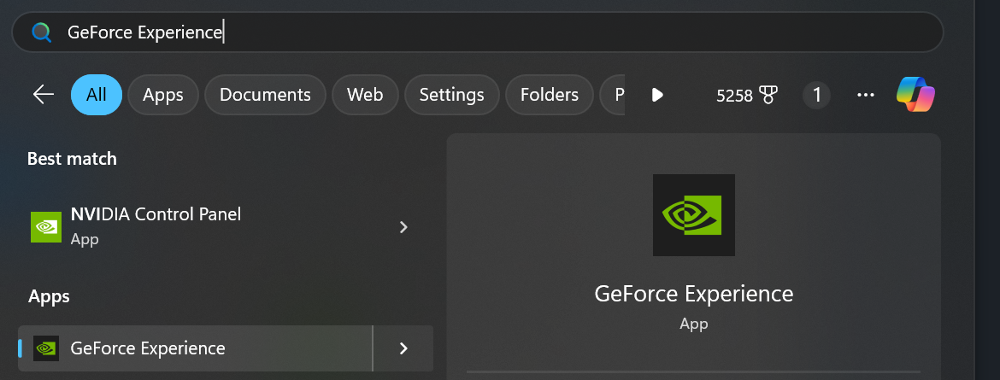
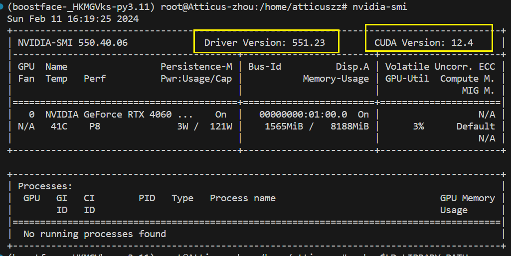
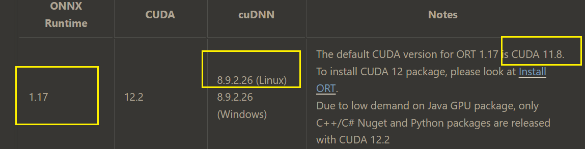
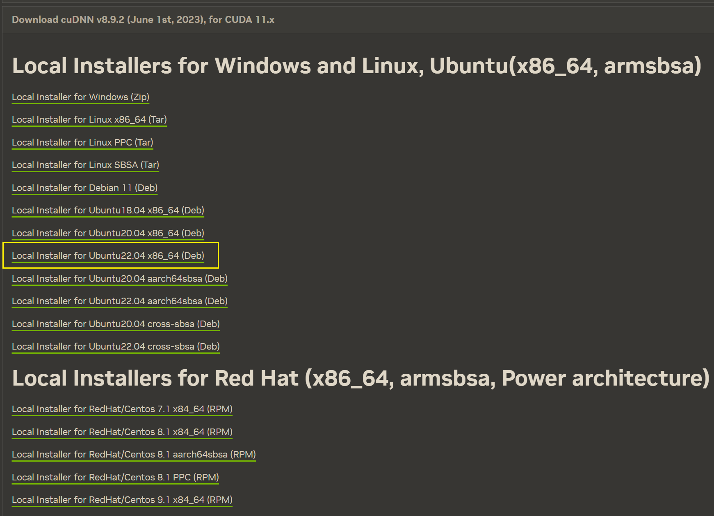
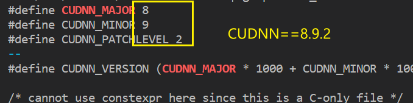

> WSL== Linux Ubuntu 22.04 x86_64

### Preconditions

1. make sure windows GPU driver has installed
   > Windows x86 drivers can be directly downloaded from[https://www.nvidia.com/Download/index.aspx](https://link.zhihu.com/?target=https%3A//www.nvidia.com/Download/index.aspx) for WSL 2 support on Pascal or later GPUs.

- if not ,install on windows by 

2. make sure the wsl kernel is updated
   > For these features, you need a kernel version of 5.10.43.3 or higher.

```powershell
# check wsl kernel version
wsl cat /proc/version
# uodate
wsl --update
```

3. check wsl2 can touch the GPU

```bash
nvidia-smi
```

- then got the following prove the `wsl` can touch the GPU
- image shows that my GPU can install the **highest** `cuda==12.4`

---

### install cuda and cudnn

**firstly, make sure the which version is needed for your installed package**

```bash
poetry add onnxruntime
```

- then check the `pyproject.toml` you got things like

```toml
[tool.poetry.dependencies]
python = "^3.11"
onnxruntime-gpu = "^1.17.0"
```

> so ,here's example for `onnxruntime-gpu==1.17`

- select proper version of onnxruntime in [NVIDIA - CUDA | onnxruntime](https://onnxruntime.ai/docs/execution-providers/CUDA-ExecutionProvider.html)
  
- as for installed `onnxruntime-gpu==1.17`, should install `cuda==11.8`, `cudnn==8.92.26`

#### cuda

1. [CUDA Toolkit Archive | NVIDIA Developer](https://developer.nvidia.com/cuda-toolkit-archive)select `cuda==11.8` and click it

- in download page select

```
linux->x86_64->WSL-ubuntu->2.0->deb(loacl)
```

- then your got it, run to install

```bash
wget https://developer.download.nvidia.com/compute/cuda/repos/wsl-ubuntu/x86_64/cuda-wsl-ubuntu.pin
sudo mv cuda-wsl-ubuntu.pin /etc/apt/preferences.d/cuda-repository-pin-600
wget https://developer.download.nvidia.com/compute/cuda/11.8.0/local_installers/cuda-repo-wsl-ubuntu-11-8-local_11.8.0-1_amd64.deb
sudo dpkg -i cuda-repo-wsl-ubuntu-11-8-local_11.8.0-1_amd64.deb
sudo cp /var/cuda-repo-wsl-ubuntu-11-8-local/cuda-*-keyring.gpg /usr/share/keyrings/sudo apt-get update
sudo apt-get -y install cuda
# if sudo apt-get -y install cuda install the wrong version
# search available package
sudo apt-cache search cuda-toolkit
# install by specifing version
sudo apt-get -y install cuda-toolkit-11-8
```

2. add env_path

```bash
sudo nano /etc/environment
# add following
PATH="/usr/local/cuda-11.8/bin:...." # insert the begin of PATH
CUDA_PATH="/usr/local/cuda"
LD_LIBRARY_PATH="/usr/local/cuda-11.8/lib64"
# apply changes
source /etc/environment
```

6. test cuda

```bash
nvcc -V
->
nvcc: NVIDIA (R) Cuda compiler driver
Copyright (c) 2005-2022 NVIDIA Corporation
Built on Wed_Sep_21_10:33:58_PDT_2022
Cuda compilation tools, release 11.8, V11.8.89
Build cuda_11.8.r11.8/compiler.31833905_0
```

- `release 11.8` -> `cuda==11.8`,if not the specified version, reinstall it

#### cudnn

1. download [cuDNN Archive | NVIDIA Developer](https://developer.nvidia.com/rdp/cudnn-archive) on windows, and upload WSL

- as for `cudnn==8.92.26` and `cuda==11.8` 
  _we assume you upload `.deb` to `/home/atticuszz/`_

2. install `.deb`

```bash
sudo dpkg -i /home/atticuszz/cudnn-local-repo-ubuntu2204-8.9.2.26_1.0-1_amd64.deb
```

> it may appear tips to cp things like ,make sure run it to Add the GPG key

```bash
sudo cp /var/cudnn-local-repo-ubuntu2204-8.9.2.26/cudnn-local-D7CBF0C2-keyring.gpg /usr/share/keyrings/

# Update the APT package index
sudo apt-get update
# Install cuDNN runtime library
sudo apt-get install libcudnn8
# for check version
sudo apt-get install libcudnn8-dev
```

3. check installed

```bash
# This should list the installed cuDNN runtime library files
ls -l /usr/lib/x86_64-linux-gnu/libcudnn*
->...

cat /usr/include/cudnn_version.h | grep CUDNN_MAJOR -A 2
```

- ->

- gpu test

```bash
docker run --gpus all nvcr.io/nvidia/k8s/cuda-sample:nbody nbody -gpu -benchmark
```
