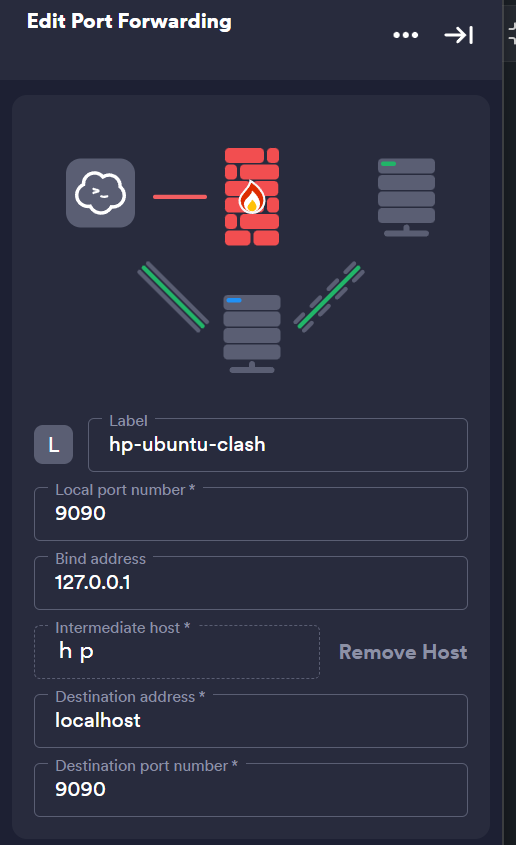

_please config proxy first, roll to botton of page_

### init

#### init install

```bash
sudo apt update
sudo apt upgrade
sudo apt install net-tools
sudo apt install curl
sudo apt-get update
sudo apt-get install unzip
```

#### auto read envs

> make ur bash auto read envs from shells like bash,zsh and Centralize it for easier management

- for origin bash
  _bash is the basic shell in linux_

```bash
nano /etc/bash.bashrc
# add following
set -a
. /etc/environment
set +a
# note it's run in new session,instead of in /etc/bash.bashrc
source /etc/bash.bashrc
```

- for zsh
  _zsh is the enhanced and popular shell_

```bash
nano ~/.zshrc
set -a
. /etc/environment
set +a
source ~/.zshrc
```

#### add envs to `/etc/environment`

```bash
echo 'MY_ENV_VAR="my_value"' | sudo tee -a /etc/environment > /dev/null

```

### code

#### install cmake

```bash
sudo apt-get update
sudo apt-get install cmake
cmake --version
```

#### install python

- python 3

```bash
sudo apt update
sudo apt install software-properties-common
sudo add-apt-repository ppa:deadsnakes/ppa
sudo apt update
sudo apt install python3.11
sudo apt-get update
sudo apt-get install python3.11-dev
python3.11 --version
sudo update-alternatives --install /usr/bin/python3 python3 /usr/bin/python3.11 1
sudo update-alternatives --config python3
```

- python pip

```bash
sudo apt update
sudo apt install python3-pip
```

- python venv

```bash
sudo apt update
sudo apt install python3-venv
python3 -m venv myenv
source myenv/bin/activate
pip install -r requirements.txt
# to get out of current venv
deactivate
```

#### install poetry

```bash
curl -sSL https://install.python-poetry.org | python3 -
nano ~/.bashrc
# add it
export PATH="/root/.local/bin:$PATH"
source ~/.bashrc
poetry --version
```

#### install zsh

see yellow hints

[ZSH + Oh My ZSH! on Windows with WSL - DEV Community](https://dev.to/equiman/zsh-on-windows-with-wsl-1jck)

1. install zsh

```bash
sudo apt install zsh
# install oh my zsh
sh -c "$(curl -fsSL https://raw.githubusercontent.com/ohmyzsh/ohmyzsh/master/tools/install.sh)"
```

2. install front,[GitHub - romkatv/powerlevel10k: A Zsh theme](https://github.com/romkatv/powerlevel10k#meslo-nerd-font-patched-for-powerlevel10k),select one of `.ttf` download and move it into `~/.front`

```bash
sudo apt install fontconfig
fc-cache -fv
```

3. install theme

```bash
git clone https://github.com/romkatv/powerlevel10k.git ${ZSH_CUSTOM:-~/.oh-my-zsh/custom}/themes/powerlevel10k
```

- add theme config `~/.zshrc`

```bash
# correct the old ZSH_THEME or can not find p10k command
ZSH_THEME="powerlevel10k/powerlevel10k"
POWERLEVEL9K_RIGHT_PROMPT_ELEMENTS=(history)
POWERLEVEL9K_SHORTEN_DIR_LENGTH=1

export LS_COLORS="rs=0:no=00:mi=00:mh=00:ln=01;36:or=01;31:di=01;34:ow=04;01;34:st=34:tw=04;34:pi=01;33:so=01;33:do=01;33:bd=01;33:cd=01;33:su=01;35:sg=01;35:ca=01;35:ex=01;32:"
```

4. restart terminal and config themes

```bash
p10k configure
```

5. install plugins

```bash
git clone https://github.com/zsh-users/zsh-autosuggestions.git ${ZSH_CUSTOM:-~/.oh-my-zsh/custom}/plugins/zsh-autosuggestions
git clone https://github.com/zsh-users/zsh-syntax-highlighting.git ${ZSH_CUSTOM:-~/.oh-my-zsh/custom}/plugins/zsh-syntax-highlighting
git clone https://github.com/Pilaton/OhMyZsh-full-autoupdate.git ${ZSH_CUSTOM:-~/.oh-my-zsh/custom}/plugins/ohmyzsh-full-autoupdate
```

- add plugins config
  _must add the following before the `source $ZSH/oh-my-zsh.sh`_

```bash
ZSH_HIGHLIGHT_HIGHLIGHTERS=(main brackets pattern cursor root line)
ZSH_HIGHLIGHT_PATTERNS=('rm -rf *' 'fg=white,bold,bg=red')

plugins=(
    adb
    command-not-found
    extract
    deno
    docker
    git
    github
    gitignore
    history-substring-search
    node
    npm
    nvm
    yarn
    volta
    vscode
    sudo
    web-search
    z
    zsh-autosuggestions
    zsh-syntax-highlighting
    ohmyzsh-full-autoupdate
)
```

6. vs code terminal , Add these properties to the user `setttings.json`

```json
{
  "terminal.integrated.fontSize": 12,
  "terminal.integrated.shellIntegration.enabled": true,
  "terminal.integrated.defaultProfile.windows": "Git Bash",
  "terminal.integrated.defaultProfile.linux": "zsh"
}
```

#### install conda

1. install by wget

```bash
wget https://repo.anaconda.com/miniconda/Miniconda3-latest-Linux-x86_64.sh
chmod +x Miniconda3-latest-Linux-x86_64.sh
./Miniconda3-latest-Linux-x86_64.sh
# note it may show that conda installed in /root/miniconda3
```

> remember set no to auto activate in your shell if u use poetry,etc to manage py-env

2. add `/root/miniconda3/bin` to `PATH` in `/etc/environment`

```bash
PATH="/root/miniconda3/bin:"
source /etc/environment
```

3. test conda

```bash
conda info
```

4.  optinal, enable auto activate conda

```bash
conda config --set auto_activate_base true
```

### net

**before ssh connect,u maybe connect by gui or connect by password**

#### install ssh

- install and start

```bash
sudo apt update
sudo apt install openssh-server
# add it into ~/.bashrc for auto start
sudo service ssh start
```

- make sure `sshd_config`

```bash
sudo nano /etc/ssh/sshd_config
# make sure
PubkeyAuthentication yes
# after connect by keys
PasswordAuthentication no
PermitRootLogin yes
```

- generate ssh-pub-key **in local machine**

```powershell

ssh-keygen -t rsa -b 4096 -C "your_email@example.com"
# select one of it
ssh-keygen -t ed25519 -C "1831768457@qq.com"
```

- add ssh-pub-key

```bash
mkdir -p ~/.ssh
chmod 700 ~/.ssh
nano ~/.ssh/authorized_keys
```

- set correct permission

```bash
chmod 600 ~/.ssh/authorized_keys
```

#### clash

[GitHub - Elegycloud/clash-for-linux-backup: Linux最完整的Clash for Linux的备份仓库，完全可以使用！由Yizuko进行修复及维护](https://github.com/Elegycloud/clash-for-linux-backup)
**or**
[GitHub - LaoYutang/clash-and-dashboard: clash-dashboard的修改版，与clash一起打包成docker镜像](https://github.com/LaoYutang/clash-and-dashboard)

- add config

```
sudo mkdir ~/.config/clash
nano /root/.config/clash/config.yaml
```

- run

```bash
docker run -d \
  --name clash \
  --restart=always \
  --log-opt max-size=1m \
  -v /root/.config/clash/config.yaml:/root/.config/clash/config.yaml \
  -p 7888:8080 -p 7890:7890 \
  laoyutang/clash-and-dashboard:latest
```

- **remember set proxy** in `/etc/environment`

```bash
nano /etc/environment
```

- add the following

```text
http_proxy="http://127.0.0.1:7890"
https_proxy="http://127.0.0.1:7890"
ftp_proxy="ftp://127.0.0.1:7890"
no_proxy="localhost,127.0.0.1,::1"
```

- apply changes

```bash
source /etc/environment
```

- test connection

```bash
curl https://www.google.com
```

####  NAT

- get download command in [花生壳客户端官方下载 - 贝锐花生壳官网](https://hsk.oray.com/download)
- tutorial in [Linux版使用教程-贝锐官网](https://service.oray.com/question/11630.html)
  > successful example ubuntu 22,(X86_64)

```bash
cd /home/atticuszz/downloads
# download commands
wget "https://dl.oray.com/hsk/linux/phddns_5.3.0_amd64.deb" -O phddns_5.3.0_amd64.deb
# install
dpkg -i phddns_5.3.0_amd64.deb
# auto start
phddns enable
# get
 +--------------------------------------------------+
 |          Oray PeanutHull Linux 5.3.0             |
 +--------------------------------------------------+
 |              Runstatus: ONLINE                   |
 +--------------------------------------------------+
 |              SN: orayec00470c5af6                |
 +--------------------------------------------------+
 |    Remote Management Address http://b.oray.com   |
 +--------------------------------------------------+
```

- login [贝锐花生壳管理](http://b.oray.com) by `orayec00470c5af6` and `admin`
- add map in [Site](https://console.hsk.oray.com/forward)

#### access port

- set local port forwarding in `Termius`
- 

#### wifi

> no test

```bash
sudo nano /etc/wpa_supplicant/wpa_supplicant.conf
# add wifi info
network={ ssid="your_network_name" psk="your_network_password" }
```

### system

#### ignore lid switch

```bash
sudo nano /etc/systemd/logind.conf
# make sure
HandleLidSwitch=ignore
HandleLidSwitchExternalPower=ignore
HandleLidSwitchDocked=ignore
# then run
sudo systemctl restart systemd-logind
```

#### gui

> no test

```bash
sudo apt update
sudo apt full-upgrade
sudo apt install --no-install-recommends xserver-xorg
sudo apt install --no-install-recommends xinit
sudo apt install raspberrypi-ui-mods
sudo apt install --no-install-recommends lightdm
```

#### change password

```powershell
# admin
wsl -u root
passwd %username% # empty for root
```

#### upgrade to root

```shell
usermod -aG sudo %username%
sudo chown -R %username%  %filepath%
# sudo chown -R atticuszz /etc/

```

### wsl

1. set default user as root

```bash
Ubuntu-22.04 config --default-user root
```

2. change to root

```bash
sudo su
```

3. enter wsl distro

```bash
wsl -l
-> wsl distro,such as Ubuntu-22.04
wsl -d <wsl distro>
```

4. set default wsl distro

```bash
wsl --set-default <wsl distro>
```

5. set default user as root

```bash
sudo nano /etc/wsl.conf
# add following
[user]
default=root
```

- then

```powershell
wsl --shutdown
```

- gpu test

```bash
docker run --gpus all nvcr.io/nvidia/k8s/cuda-sample:nbody nbody -gpu -benchmark
```

#### proxy

> set .wslconfig to enable share proxy 

😊best one for latest wsl
1. in your `C:\Users\<username>` create `.wslconfig`
```text
[wsl2] 
autoProxy=true
networkingMode=mirrored
firewall=true
```
2. restart wsl 
```powershell
wsl --shutdown 
wsl
```
 
> shell for auto set proxy as wsl start

_set proxies manually and try set auto start with sh_
1. enable systemd
```bash
sudo nano /etc/wsl.conf

# add it 
[boot]
systemd=false
```
2. add wget .sh for auto start with set proxies
```bash
# 使用wget下载脚本
wget -O /tmp/set_proxy_as_start_up.sh https://raw.githubusercontent.com/Atticuszz/PyGizmoKit/main/scripts/set_proxy_as_start_up.sh

# 给脚本执行权限
chmod +x /tmp/set_proxy_as_start_up.sh

# 执行脚本
sudo /tmp/set_proxy_as_start_up.sh

```


>set proxies manually, connect to your clash proxy old way 

```bash
sudo nano /etc/environment
```

- check clash proxy of `allow lan` wifi `ipv4`

```
# add following
http_proxy="http://192.168.0.107:7890"
https_proxy="http://192.168.0.107:7890"
ftp_proxy="ftp://192.168.0.107:7890"
no_proxy="localhost,127.0.0.1,::1"
```

- apply changes

```bash
source /etc/environment
```


### BUGs

1. run `sudo apt-get update` got

```bash
root@Atticus-zhou:/home/atticuszz# sudo apt-get update
Hit:1 http://archive.ubuntu.com/ubuntu jammy InRelease           Hit:2 https://download.docker.com/linux/ubuntu jammy InRelease   Hit:3 https://developer.download.nvidia.com/compute/cuda/repos/wsl-ubuntu/x86_64  InRelease
Hit:4 http://security.ubuntu.com/ubuntu jammy-security InRelease                                                           Hit:5 https://ppa.launchpadcontent.net/deadsnakes/ppa/ubuntu jammy InRelease
Hit:6 http://archive.ubuntu.com/ubuntu jammy-updates InRelease
Hit:7 http://archive.ubuntu.com/ubuntu jammy-backports InRelease
Traceback (most recent call last):
  File "/usr/lib/cnf-update-db", line 3, in <module>
    import apt_pkg
ModuleNotFoundError: No module named 'apt_pkg'
Reading package lists... Done
E: Problem executing scripts APT::Update::Post-Invoke-Success 'if /usr/bin/test -w /var/lib/command-not-found/ -a -e /usr/lib/cnf-update-db; then /usr/lib/cnf-update-db > /dev/null; fi'
E: Sub-process returned an error code
```

- solved by following

```bash
cd /usr/lib/python3/dist-packages
ls -la | grep "apt_pkg.cpython"
-> -rw-r--r--  1 root root 347096 Aug  2  2023 apt_pkg.cpython-310-x86_64-linux-gnu.so
# then cp that apt_pkg.cpython-310-x86_64-linux-gnu.so
 sudo cp apt_pkg.cpython-310-x86_64-linux-gnu.so apt_pkg.so
```
