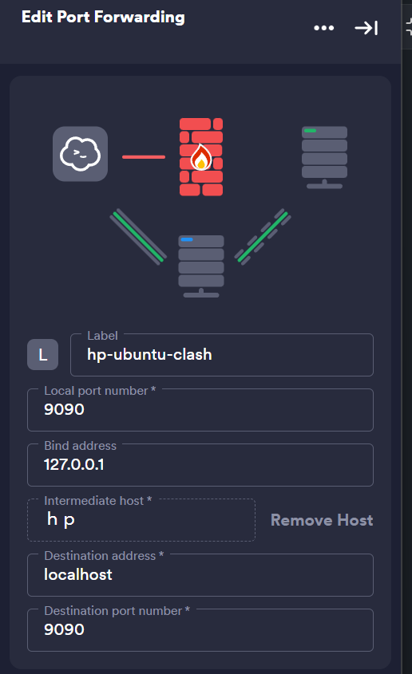

### net

**before ssh connect,u maybe connect by gui or connect by password**

#### install ssh

- install and start

```bash
sudo apt update
sudo apt install openssh-server
# add it into ~/.bashrc for auto start
sudo service ssh start
```

- make sure `sshd_config`

```bash
sudo nano /etc/ssh/sshd_config
# make sure
PubkeyAuthentication yes
# after connect by keys
PasswordAuthentication no
PermitRootLogin yes
```

- generate ssh-pub-key **in local machine**

```powershell

ssh-keygen -t rsa -b 4096 -C "your_email@example.com"
# select one of it
ssh-keygen -t ed25519 -C "1831768457@qq.com"
```

- add ssh-pub-key

```bash
mkdir -p ~/.ssh
chmod 700 ~/.ssh
nano ~/.ssh/authorized_keys
```

- set correct permission

```bash
chmod 600 ~/.ssh/authorized_keys
```

#### clash

[GitHub - Elegycloud/clash-for-linux-backup: Linux最完整的Clash for Linux的备份仓库，完全可以使用！由Yizuko进行修复及维护](https://github.com/Elegycloud/clash-for-linux-backup)
**or**
[GitHub - LaoYutang/clash-and-dashboard: clash-dashboard的修改版，与clash一起打包成docker镜像](https://github.com/LaoYutang/clash-and-dashboard)

- add config

```bash
sudo mkdir ~/.config/clash
wget https://github.com/SupaVision/DocHub/releases/download/clash/clash_proxies_config.yml -O /root/.config/clash/config.yaml
```

- run

```bash
docker run -d \
  --name clash \
  --restart=always \
  --log-opt max-size=1m \
  -v /root/.config/clash/config.yaml:/root/.config/clash/config.yaml \
  -p 7888:8080 -p 7890:7890 \
  laoyutang/clash-and-dashboard:latest
```

- **remember set proxy** in `/etc/environment`

```bash
nano /etc/environment
```

- add the following

```text
http_proxy="http://127.0.0.1:7890"
https_proxy="http://127.0.0.1:7890"
ftp_proxy="ftp://127.0.0.1:7890"
no_proxy="localhost,127.0.0.1,::1"
```

- apply changes

```bash
source /etc/environment
```

- test connection

```bash
curl https://www.google.com
```

####  NAT

- get download command in [花生壳客户端官方下载 - 贝锐花生壳官网](https://hsk.oray.com/download)
- tutorial in [Linux版使用教程-贝锐官网](https://service.oray.com/question/11630.html)
  > successful example ubuntu 22,(X86_64)

```bash
cd /home/atticuszz/downloads
# download commands
wget "https://dl.oray.com/hsk/linux/phddns_5.3.0_amd64.deb" -O phddns_5.3.0_amd64.deb
# install
dpkg -i phddns_5.3.0_amd64.deb
# auto start
phddns enable
# get
 +--------------------------------------------------+
 |          Oray PeanutHull Linux 5.3.0             |
 +--------------------------------------------------+
 |              Runstatus: ONLINE                   |
 +--------------------------------------------------+
 |              SN: orayec00470c5af6                |
 +--------------------------------------------------+
 |    Remote Management Address http://b.oray.com   |
 +--------------------------------------------------+
```

- login [贝锐花生壳管理](http://b.oray.com) by `orayec00470c5af6` and `admin`
- add map in [Site](https://console.hsk.oray.com/forward)

#### access port

- set local port forwarding in `Termius`
- 
