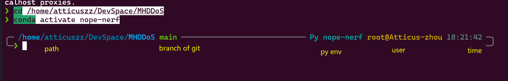

#### auto read envs

> make ur bash auto read envs from shells like bash,zsh and Centralize it for easier management

- for origin bash
  _bash is the basic shell in linux_

```bash
nano /etc/bash.bashrc
# add following
set -a
. /etc/environment
set +a
# note it's run in new session,instead of in /etc/bash.bashrc
source /etc/bash.bashrc
```

- for zsh
  _zsh is the enhanced and popular shell_

```bash
nano ~/.zshrc
set -a
. /etc/environment
set +a
source ~/.zshrc
```

#### add envs to `/etc/environment`

```bash
echo 'MY_ENV_VAR="my_value"' | sudo tee -a /etc/environment > /dev/null

```

#### install zsh

see yellow hints

[ZSH + Oh My ZSH! on Windows with WSL - DEV Community](https://dev.to/equiman/zsh-on-windows-with-wsl-1jck)

1. install zsh

```bash
sudo apt install zsh
# install oh my zsh
sh -c "$(curl -fsSL https://raw.githubusercontent.com/ohmyzsh/ohmyzsh/master/tools/install.sh)"
```

2. install front,[GitHub - romkatv/powerlevel10k: A Zsh theme](https://github.com/romkatv/powerlevel10k#meslo-nerd-font-patched-for-powerlevel10k),select one of `.ttf` download and move it into `~/.front`

```bash
sudo apt install fontconfig
fc-cache -fv
```

3. install theme

```bash
git clone https://github.com/romkatv/powerlevel10k.git ${ZSH_CUSTOM:-~/.oh-my-zsh/custom}/themes/powerlevel10k
```

- add theme config `~/.zshrc`

```bash
# correct the old ZSH_THEME or can not find p10k command
ZSH_THEME="powerlevel10k/powerlevel10k"
POWERLEVEL9K_RIGHT_PROMPT_ELEMENTS=(history)
POWERLEVEL9K_SHORTEN_DIR_LENGTH=1

export LS_COLORS="rs=0:no=00:mi=00:mh=00:ln=01;36:or=01;31:di=01;34:ow=04;01;34:st=34:tw=04;34:pi=01;33:so=01;33:do=01;33:bd=01;33:cd=01;33:su=01;35:sg=01;35:ca=01;35:ex=01;32:"
```

4. restart terminal and config themes

```bash
p10k configure
```

5. install plugins

```bash
git clone https://github.com/zsh-users/zsh-autosuggestions.git ${ZSH_CUSTOM:-~/.oh-my-zsh/custom}/plugins/zsh-autosuggestions
git clone https://github.com/zsh-users/zsh-syntax-highlighting.git ${ZSH_CUSTOM:-~/.oh-my-zsh/custom}/plugins/zsh-syntax-highlighting
git clone https://github.com/Pilaton/OhMyZsh-full-autoupdate.git ${ZSH_CUSTOM:-~/.oh-my-zsh/custom}/plugins/ohmyzsh-full-autoupdate
```

- add plugins config
  _must add the following before the `source $ZSH/oh-my-zsh.sh`_

```bash
ZSH_HIGHLIGHT_HIGHLIGHTERS=(main brackets pattern cursor root line)
ZSH_HIGHLIGHT_PATTERNS=('rm -rf *' 'fg=white,bold,bg=red')

plugins=(
    adb
    command-not-found
    extract
    deno
    docker
    git
    github
    gitignore
    history-substring-search
    node
    npm
    nvm
    yarn
    volta
    vscode
    sudo
    web-search
    z
    zsh-autosuggestions
    zsh-syntax-highlighting
    ohmyzsh-full-autoupdate
)
```

6. vs code terminal , Add these properties to the user `setttings.json`

```json
{
  "terminal.integrated.fontSize": 12,
  "terminal.integrated.shellIntegration.enabled": true,
  "terminal.integrated.defaultProfile.windows": "Git Bash",
  "terminal.integrated.defaultProfile.linux": "zsh"
}
```
