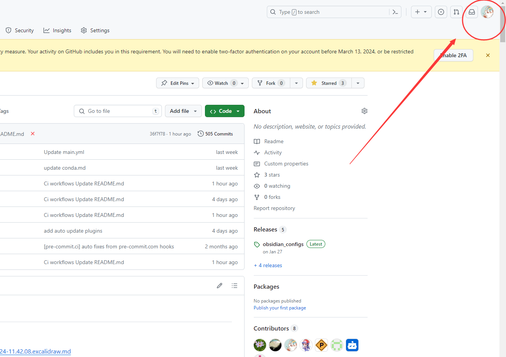
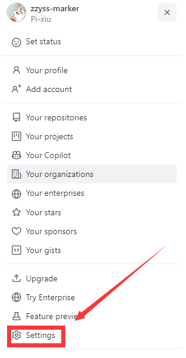
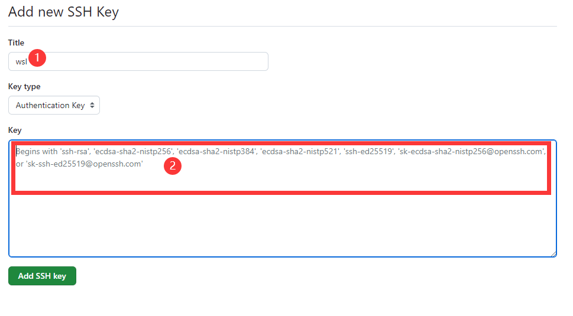

### set default user as root

```bash
sudo nano /etc/wsl.conf
# add following
[user]
default=root
```

### set default distro

1. enter wsl distro

```bash
wsl -l
-> wsl distro,such as Ubuntu-22.04
wsl -d <wsl distro>
```

3. set default wsl distro

```bash
wsl --set-default <wsl distro>
```

- then

```powershell
wsl --shutdown
```

#### proxy

[WSL2 网络的最终解决方案 - 知乎](https://zhuanlan.zhihu.com/p/593263088?utm_id=0)
[Advanced settings configuration in WSL | Microsoft Learn](https://learn.microsoft.com/en-us/windows/wsl/wsl-config)

> set .wslconfig to enable share proxy

😊best one for latest wsl

1. in your `C:\Users\<username>` create `.wslconfig`

*if existed,open it by ps*
```powershell
notepad $env:USERPROFILE\.wslconfig
```

```text
[wsl2]
autoProxy=true
networkingMode=mirrored
firewall=true
```

2. restart wsl

```powershell
wsl --shutdown
wsl
```

> shell for auto set proxy as wsl start

_set proxies manually and try set auto start with sh_

1. enable systemd

```bash
sudo nano /etc/wsl.conf

# add it
[boot]
systemd=false
```

2. add wget .sh for auto start with set proxies

```bash
# 使用wget下载脚本
wget -O /tmp/set_proxy_as_start_up.sh https://raw.githubusercontent.com/Atticuszz/PyGizmoKit/main/scripts/set_proxy_as_start_up.sh

# 给脚本执行权限
chmod +x /tmp/set_proxy_as_start_up.sh

# 执行脚本
sudo /tmp/set_proxy_as_start_up.sh

```

> set proxies manually, connect to your clash proxy old way

```bash
sudo nano /etc/environment
```

- check clash proxy of `allow lan` wifi `ipv4`

```
# add following
http_proxy="http://192.168.0.107:7890"
https_proxy="http://192.168.0.107:7890"
ftp_proxy="ftp://192.168.0.107:7890"
no_proxy="localhost,127.0.0.1,::1"
```

- apply changes

```bash
source /etc/environment
```

### Fixed permission issues that occurred when wsl pushed code

解决在 wsl 中普通的网页令牌认证，推送代码的过程中出现了权限问题，使用 ssh 配 https 转发解决推送的身份验证问题

git ssh命令详见 [SSH](../../../docs/VCS/git.md)，具体操作如下

### 1. 添加SSH密钥

首先，将SSH私钥添加到wsl中,在bash中执行以下命令：

```powershell/bash
ssh-keygen -t ed25519 -C "1831768457@qq.com"
```

请确保将`1831768457@qq.com`邮箱替换为你GitHub账户的实际邮箱。

用vscode连接wsl访问文件`cat /root/.ssh/id_ed25519.pub`或使用命令行

```bash
cat /root/.ssh/id_ed25519.pub
```

在GitHub中添加ssh密匙




添加`id_ed25519.pub`的内容到2的框中

### 2. 通过HTTPS测试SSH连接

GitHub支持通过HTTPS端口443进行SSH连接。这对于在某些网络环境下，标准SSH端口22被阻塞的情况特别有用。使用以下命令测试SSH连接：

```shell
ssh -T -p 443 git@ssh.github.com
```

如果是第一次连接到GitHub服务器，可能会提示您确认服务器的身份。输入`yes`以继续。

### 3. 配置SSH

为了使SSH连接自动使用HTTPS端口，需要配置SSH客户端。这涉及到编辑`~/.ssh/config`文件（在Linux或WSL中）或`C:\Users\您的用户名\.ssh\config`文件（在Windows中）。

首先，使用nano编辑器（或任何您喜欢的文本编辑器）打开或创建配置文件：

```bash
nano ~/.ssh/config
```

然后，将以下内容添加到配置文件中：

```text
Host github.com
    Hostname ssh.github.com
    Port 443
    User git
```

这告诉SSH客户端，当尝试连接到`github.com`时，应该使用`ssh.github.com`作为主机名，并通过端口443进行连接。

### 4. 测试SSH连接

配置完成后，您应该测试SSH连接以确保一切工作正常：

```powershell
ssh -T git@github.com
```

如果配置正确，GitHub会通过SSH响应您的用户名，表示您已成功设置SSH连接。

### 5. 尝试提交

使用ssh克隆仓库

```
git@github.com:SupaVision/AutoDrive_backend.git
```

使用gateway的pycharm连接wsl，对仓库中的某个代码添加注释按Ctrl+K，点击commit and push，尝试提交，如果提交成功，说明配置正常，可以进行愉快的代码协作啦
