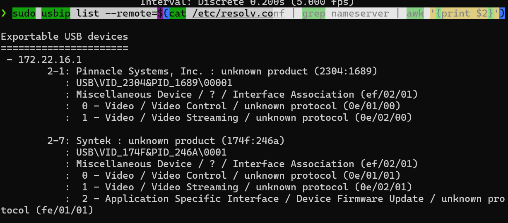
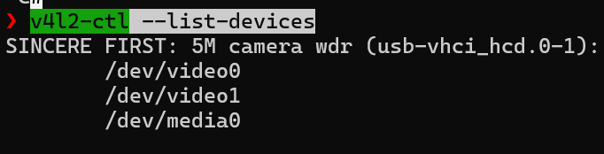
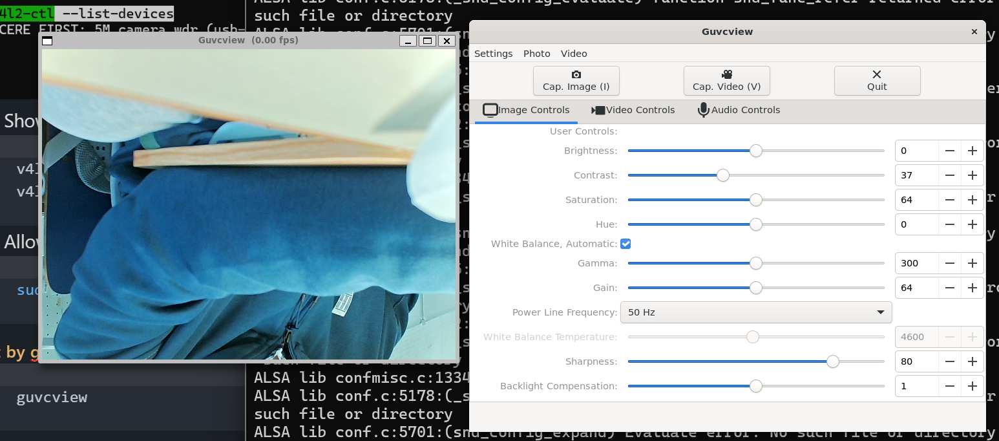

### set default user as root

```bash
sudo nano /etc/wsl.conf
# add following
[user]
default=root
```

### set default distro

1. enter wsl distro

```bash
wsl -l
-> wsl distro,such as Ubuntu-22.04
wsl -d <wsl distro>
```

3. set default wsl distro

```bash
wsl --set-default <wsl distro>
```

- then

```powershell
wsl --shutdown
```

#### proxy

[WSL2 网络的最终解决方案 - 知乎](https://zhuanlan.zhihu.com/p/593263088?utm_id=0)
[Advanced settings configuration in WSL | Microsoft Learn](https://learn.microsoft.com/en-us/windows/wsl/wsl-config)

> set .wslconfig to enable share proxy

😊best one for latest wsl

1. in your `C:\Users\<username>` create `.wslconfig`

_if existed,open it by ps_

```powershell
notepad $env:USERPROFILE\.wslconfig
```

```text
[wsl2]
autoProxy=true
networkingMode=mirrored
firewall=true
```

2. restart wsl

```powershell
wsl --shutdown
wsl
```

> shell for auto set proxy as wsl start

_set proxies manually and try set auto start with sh_

1. enable systemd

```bash
sudo nano /etc/wsl.conf

# add it
[boot]
systemd=true
```

2. add wget .sh for auto start with set proxies

```bash
# 使用wget下载脚本
wget -O /tmp/set_proxy_as_start_up.sh https://raw.githubusercontent.com/Atticuszz/PyGizmoKit/main/scripts/set_proxy_as_start_up.sh

# 给脚本执行权限
chmod +x /tmp/set_proxy_as_start_up.sh

# 执行脚本
sudo /tmp/set_proxy_as_start_up.sh

```

> set proxies manually, connect to your clash proxy old way

```bash
sudo nano /etc/environment
```

- check clash proxy of `allow lan` wifi `ipv4`

```
# add following
http_proxy="http://192.168.0.107:7890"
https_proxy="http://192.168.0.107:7890"
ftp_proxy="ftp://192.168.0.107:7890"
no_proxy="localhost,127.0.0.1,::1"
```

- apply changes

```bash
source /etc/environment
```

### share wsl port in LAN

[Accessing network applications with WSL | Microsoft Learn](https://learn.microsoft.com/en-us/windows/wsl/networking)

> use **NAT** mode works for me

1. find `wsl ip` relative to windows

```powershell
 wsl hostname -I
```


2. enable port bind
   `wsl-ip` = `192.168.245.116`
   port bind = 5000:5000

```powershell
netsh interface portproxy add v4tov4 listenport=5000 listenaddress=0.0.0.0 connectport=5000 connectaddress=192.168.245.116
```

3. access port via wifi ipv4,you can see it in clash or run `ipconfig`

### install wsl-linux kernel to enable access to usb device

> [WSL/Connect USB devices/USB Camera.md at main · phuoctan4141/WSL · GitHub](https://github.com/phuoctan4141/WSL/blob/main/Connect%20USB%20devices/USB%20Camera.md) update from

#### download kernel

1. update to latest wsl

```bash
wsl --update
```

2. check your version

```bash
uname -r
-> 5.15.133.1-microsoft-standard-WSL2
```

3. select [Releases · microsoft/WSL2-Linux-Kernel](https://github.com/microsoft/WSL2-Linux-Kernel/releases) to download via `wget` into any dir such `/usr/src/`

```bash
cd /usr/src/
wget https://github.com/microsoft/WSL2-Linux-Kernel/archive/refs/tags/linux-msft-wsl-5.15.133.1.zip
unzip linux-msft-wsl-5.15.133.1.zip
# to see which folder to cd
ls
-> WSL2-Linux-Kernel-linux-msft-wsl-5.15.133.1
cd WSL2-Linux-Kernel-linux-msft-wsl-5.15.133.1
```

4. Copy current configuration file.

```bash
sudo cp /proc/config.gz config.gz
sudo gunzip config.gz
sudo mv config .config
```

You may need to set `CONFIG_USB=y` in `.config` prior to running `menuconfig `to get all options enabled for selection. use `nano` to check it

#### config kernel

> Select different modules according to your own needs. (Press space to select or deselect.)

1. Run `menuconfig` to select kernel features to add.

```shell
sudo make menuconfig
```

_all in device driver menu_ 2. These are the necessary additional features in `menuconfig`.

```text

Device Drivers->USB support[*]
Device Drivers->USB support->Support for Host-side USB[M]
Device Drivers->USB support->Enable USB persist by default[*]
Device Drivers->USB support->USB Modem (CDC ACM) support[M]
Device Drivers->USB support->USB Mass Storage support[M]
Device Drivers->USB support->USB/IP support[M]
Device Drivers->USB support->VHCI hcd[M]
Device Drivers->USB support->VHCI hcd->Number of ports per USB/IP virtual host controller(8)
Device Drivers->USB support->Number of USB/IP virtual host controllers(1)
Device Drivers->USB support->USB Serial Converter support[M]
Device Drivers->USB support->USB Serial Converter support->USB FTDI Single Port Serial Driver[M]
Device Drivers->USB support->USB Physical Layer drivers->NOP USB Transceiver Driver[M]
Device Drivers->Network device support->USB Network Adapters[M]
Device Drivers->Network device support->USB Network Adapters->[Deselect everything you dont care about]
Device Drivers->Network device support->USB Network Adapters->Multi-purpose USB Networking Framework[M]
Device Drivers->Network device support->USB Network Adapters->CDC Ethernet support (smart devices such as cable modems)[M]
Device Drivers->Network device support->USB Network Adapters->Host for RNDIS and ActiveSync devices[M]
```

3. These are **additional** features required for the camera.

```text

Device Drivers->Multimedia support[M]
Device Drivers->Multimedia support[M]->Filter media drivers[*]
Device Drivers->Multimedia support[M]->Auto ancillary drivers[*]
Device Drivers->Multimedia support[M]->Media device types->Camera and video grabbers[*]
Device Drivers->Multimedia support[M]->Video4Linux options->V4L2 sub-device userspace API[*]
Device Drivers->Multimedia support[M]->Media drivers->Media USB Adapters[*]
Device Drivers->Multimedia support[M]->Media drivers->Media USB Adapters[*]->USB Video Class(UVC)[M]
Device Drivers->Multimedia support[M]->Media drivers->Media USB Adapters[*]->UVC input evnets device support[*]
```

⚠️ These instructions have changed. Previously, it was recommended to enable "Debug messages for USB/IP". However, debug messages have a huge negative performance impact on bulk transfers. Enabling debug messages is no longer recommended.

#### compile and build

> In the following command the number '16' is the number of cores to use; **run** `getconf _NPROCESSORS_ONLN` to find the number of cores.

1. compile kernel

```bash
sudo make -j 16 && sudo make modules_install -j 16 && sudo make install -j 16
```

2. Build USB/IP tools.

```bash
cd tools/usb/usbip
sudo ./autogen.sh
sudo ./configure
sudo make install -j 16
```

3. Copy tools libraries location so usbip tools can get them.

```bash
sudo cp libsrc/.libs/libusbip.so.0 /lib/libusbip.so.0
```

4. Install usb.ids so you have names displayed for usb devices.

```bash
sudo apt install linux-tools-virtual hwdata
```

5. From the **root path of the repo that you cloned**, copy the image.

```bash
cp arch/x86/boot/bzImage /mnt/c/Users/<username>/usbip-bzImage
```

#### config wsl

Create a `.wslconfig` file on `/mnt/c/Users/<username>/` and add a reference to the created image with the following.

```.wslconfig
[wsl2]
kernel=c:\\users\\<username>\\usbip-bzImage
```

> then remember to restart wsl

#### bind usb device

[Connect USB devices | Microsoft Learn](https://learn.microsoft.com/en-us/windows/wsl/connect-usb)

> `usbipd` download from [Releases · dorssel/usbipd-win](https://github.com/dorssel/usbipd-win/releases)

From an **administrator Powershell** on Windows, run this command. It will list all the USB devices connected to Windows.

1. find usb device

```powershell
usbipd list
```

> i have two camera now, 2-1 and 2-7
>  2. bind and attach device

```powershell
usbipd bind --busid 2-1
usbipd attach --wsl --busid 2-1
usbipd bind --busid 2-7
usbipd attach --wsl --busid 2-7
```

3. check in wsl

```bash
sudo usbip list --remote=$(cat /etc/resolv.conf | grep nameserver | awk '{print $2}')
```



> it shows that connect two devices successful

- the following in is optional, if get none before, run it

```bash

sudo usbip attach --remote=$(cat /etc/resolv.conf | grep nameserver | awk '{print $2}') --busid=2-1
```

#### test device

At this moment, it can be found that it has appeared and can be tested with `/dev/video0`

```shell
 sudo apt update
sudo apt install guvcview
sudo apt install v4l-utils
```

1. Examine device access.

```shell
v4l2-ctl --list-devices
```

 2. Show webcamera information

```
v4l2-ctl -d /dev/video0 --all
v4l2-ctl -d /dev/video0 --list-formats-ext
```

3. Allow access by using

```shell
sudo chmod 777 /dev/video0
```

#### test by gui

```
guvcview
```



### push to github via ssh

解决在 wsl 中普通的网页令牌认证，推送代码的过程中出现了权限问题，使用 ssh 配 https 转发解决推送的身份验证问题

git ssh命令详见 [SSH](../../../docs/VCS/git.md)，具体操作如下

1. 添加SSH密钥

首先，将SSH私钥添加到wsl中,在bash中执行以下命令：

```powershell/bash
ssh-keygen -t ed25519 -C "1831768457@qq.com"
```

请确保将`1831768457@qq.com`邮箱替换为你GitHub账户的实际邮箱。

用vscode连接wsl访问文件`cat /root/.ssh/id_ed25519.pub`或使用命令行

```bash
cat /root/.ssh/id_ed25519.pub
```

在GitHub中添加ssh密匙


添加`id_ed25519.pub`的内容到2的框中

2. 通过HTTPS测试SSH连接

GitHub支持通过HTTPS端口443进行SSH连接。这对于在某些网络环境下，标准SSH端口22被阻塞的情况特别有用。使用以下命令测试SSH连接：

```shell
ssh -T -p 443 git@ssh.github.com
```

如果是第一次连接到GitHub服务器，可能会提示您确认服务器的身份。输入`yes`以继续。

3. 配置SSH

为了使SSH连接自动使用HTTPS端口，需要配置SSH客户端。这涉及到编辑`~/.ssh/config`文件（在Linux或WSL中）或`C:\Users\您的用户名\.ssh\config`文件（在Windows中）。

首先，使用nano编辑器（或任何您喜欢的文本编辑器）打开或创建配置文件：

```bash
nano ~/.ssh/config
```

然后，将以下内容添加到配置文件中：

```text
Host github.com
    Hostname ssh.github.com
    Port 443
    User git
```

这告诉SSH客户端，当尝试连接到`github.com`时，应该使用`ssh.github.com`作为主机名，并通过端口443进行连接。

4.  测试SSH连接

配置完成后，您应该测试SSH连接以确保一切工作正常：

```powershell
ssh -T git@github.com
```

如果配置正确，GitHub会通过SSH响应您的用户名，表示您已成功设置SSH连接。

5. 尝试提交

使用ssh克隆仓库

```
git clone git@github.com:SupaVision/AutoDrive_backend.git
```

使用gateway的pycharm连接wsl，对仓库中的某个代码添加注释按Ctrl+K，点击commit and push，尝试提交，如果提交成功，说明配置正常，可以进行愉快的代码协作啦
