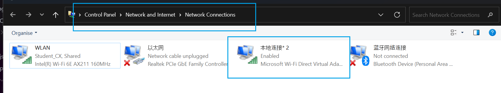
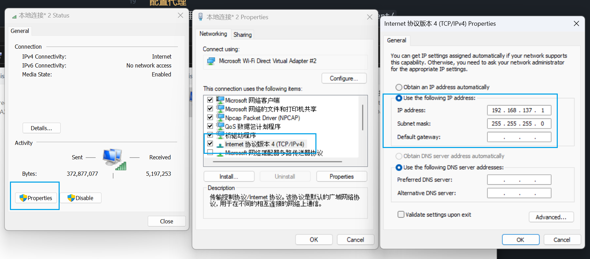
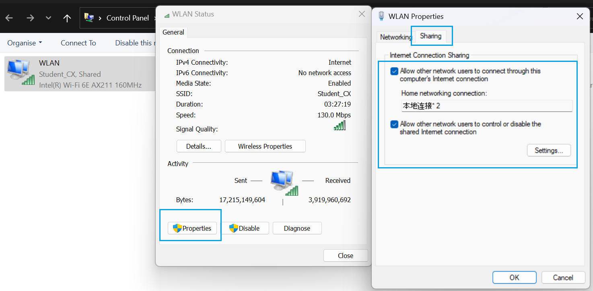
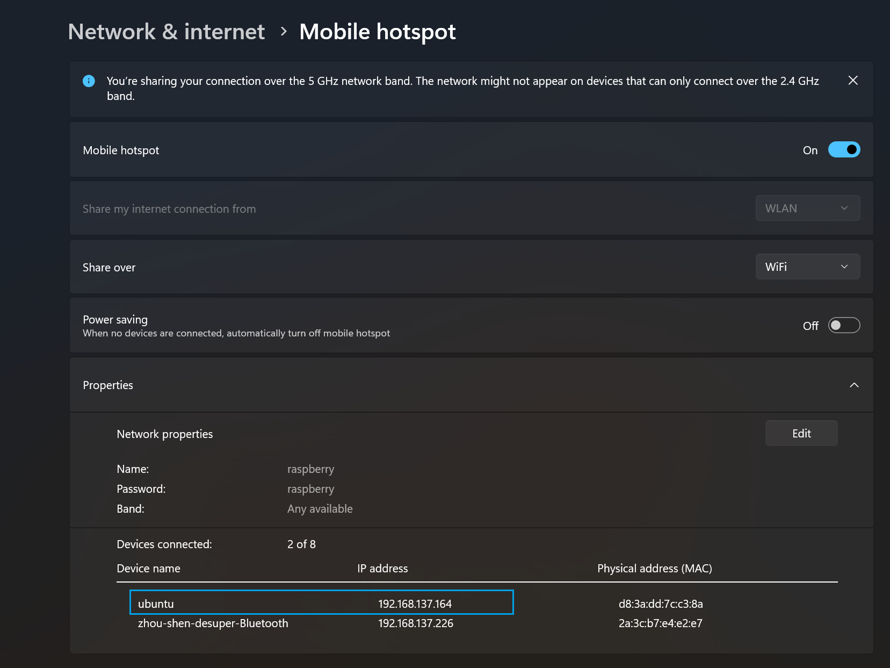

> 基本配置完毕，zsh，poetry，python 3.11,docker,vscode server和它的基本内置插件,代码仓库在/home/pi/devspace下面


使用vscode连接之前务必配置好 电脑热点，就相当于自动连接了
vscode连接之前要在c盘的ssh配置添加vscode连接的初始配置
然后vscode就可以直接连接了，注意clash开启allow lan
**断电不是直接拔掉！！！**

```bash
sudo shutdown -h now
```

[ROSMASTER X3](https://www.yahboom.com/study/ROSMASTER-X3)

### 烧录系统

[Raspberry Pi OS – Raspberry Pi](https://www.raspberrypi.com/software/)
下载安装器，找到ubuntu 最新的下载，得有读卡器
，选`other general os`选server类型的，不需要图形界面的话，ubunut22-lts这种

> 当前烧录的是ubuntu22 server lts

安装器烧录之前，会跳出来配置网络，内容和下面网络配置一致

#### default user

```powershell
ssh pi@192.168.137.10
->12345678
```

> 初始wifi配置，密码账号都是`raspberry`，电脑热点也配置这个

### 配置网络

#### 网络参考

1. raspberry wifis ipv4 = `192.168.137.10`
2. windows hotspot ipv4 = `192.168.137.1`

#### 配置代理

[wsl](docs/OS/Ubuntu/wsl#proxy) 和这里类似，只不过选择手动修改`/etc/environment/`
ip都换掉=`192.168.137.1`

#### 配置电脑热点

1. `设置->移动热点`中配置账号密码都是`raspberry`，打开之后，并且把省电模式关掉，懒得每次手动打开
2. 打开控制面板->网络和因特网->网络共享中心->修改网络适配器设置
   本地连接应该是网络热点，
   和图中一致，从而设置电脑相对于raspberry的固定ip
3. 确保共享wifi给热点
   

- 这时候通电，等一会，就可以查看raspberry default ip,
  
- 初次连接使用这个ip，尝试一下，密码不对没事，激活ssh服务，然后再用最前面的用户登陆进去

```bash
ssh ubuntu@192.168.137.164
```

#### 分配固定ip

> 如果没有再启动之前配置好wifi，你是接不上的需要读卡器，[Linux File Systems for Windows | Paragon Software](https://www.paragon-software.com/us/home/linuxfs-windows/)配上这个软件，让sd分区变成windows可读，修改同样的文件

```bash
sudo nano /etc/netplan/50-cloud-init.yaml
```

- 配置raspberry固定ip=`192.168.137.10`, 电脑热点ip=`192.168.137.1`

```yaml
network:
  version: 2
  renderer: networkd
  wifis:
    wlan0:
      access-points:
        "raspberry":
          password: "raspberry"
      dhcp4: no
      addresses: [192.168.137.10/24]
      routes:
        - to: default
          via: 192.168.137.1
      nameservers:
        addresses: [8.8.8.8, 8.8.4.4]
      optional: true
```

```bash
sudo netplan apply
```
### 建立链接

如果上面都配置好了，那么打开热点，接上电，用默认用户就可以ssh登陆了

#### vscode

`id_ed25519`密钥
`C:\Users\<改成你的用户名>\.ssh\config`中追加这个

```
Host 192.168.137.10
    HostName 192.168.137.10
    User root
    IdentityFile C:\Users\<改成你的用户名>\.ssh\id_ed25519
    ForwardX11 yes
```


#### docker
```bash
sudo apt update
sudo apt install apt-transport-https ca-certificates curl software-properties-common
curl -fsSL https://download.docker.com/linux/ubuntu/gpg | sudo gpg --dearmor -o /usr/share/keyrings/docker-archive-keyring.gpg

echo "deb [arch=arm64 signed-by=/usr/share/keyrings/docker-archive-keyring.gpg] https://download.docker.com/linux/ubuntu jammy stable" | sudo tee /etc/apt/sources.list.d/docker.list > /dev/null
sudo apt update
sudo apt install docker-ce docker-ce-cli containerd.io
sudo systemctl start docker
sudo systemctl enable docker
sudo curl -L "https://github.com/docker/compose/releases/download/v2.24.1/docker-compose-$(uname -s)-$(uname -m)" -o /usr/local/bin/docker-compose
sudo chmod +x /usr/local/bin/docker-compose
docker-compose --version

```

#### ROS2
