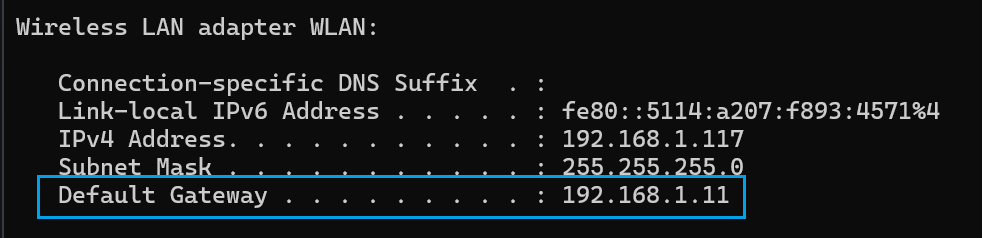
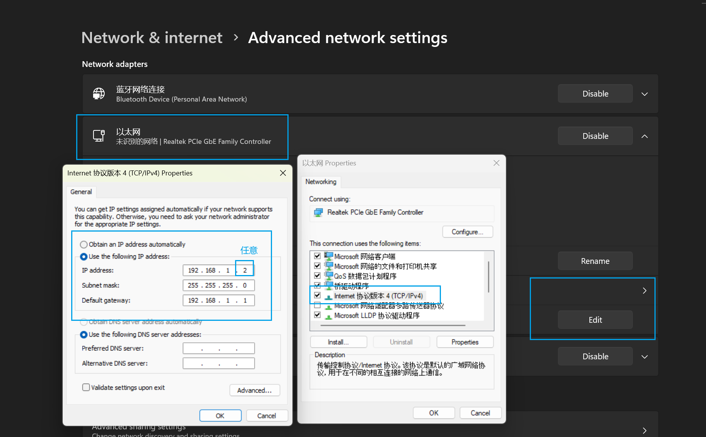
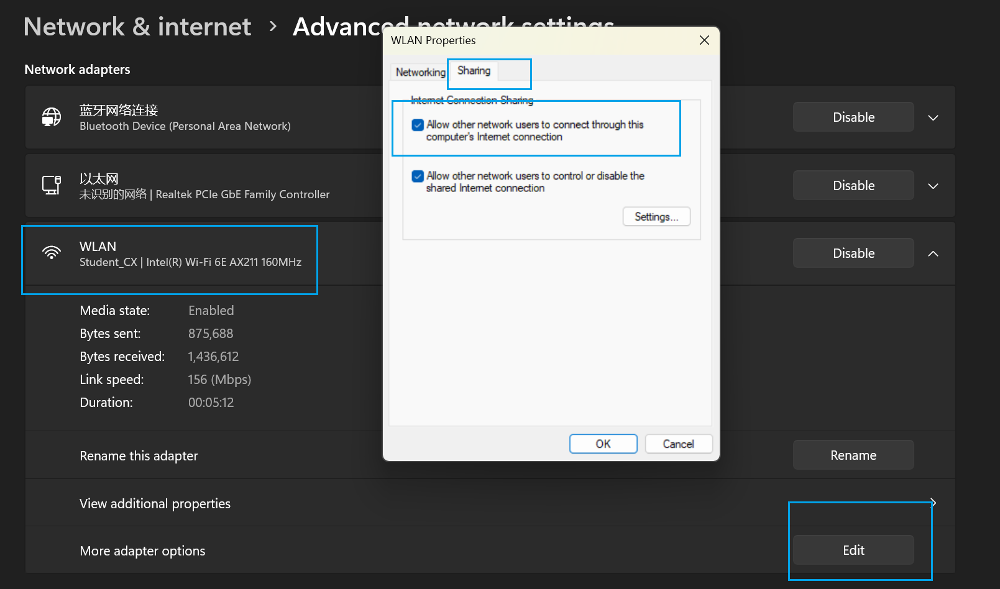

### 建立链接

#### 初次

1. type-c供电，找到热点`ROSMASTER`，密码`12345678`，电脑连接上他
2. 查找raspberry地址

```powershell
ipconfig
```

 3. 记录这个默认网关的地址`192.168.1.11`，ssh链接，密码是`raspberry`,`yahboom`

> 输入密码的时候没显示很正常，继续输入就好了，自动隐藏了

```powershell
ssh pi@192.168.1.11
```

#### 网线连接

1. 配置静态地址

```bash
sudo nano /etc/network/interfaces
# add it
auto eth0
iface eth0 inet static
    address 192.168.1.100
    netmask 255.255.255.0
    gateway 192.168.1.1
    dns-nameservers 8.8.8.8 8.8.4.4
# add before
sudo systemctl restart networking
```

2. 电脑配置以太网固定ip
   
3. 并且设置共享wifi网络
4. 使用固定的`192.168.1.100`
