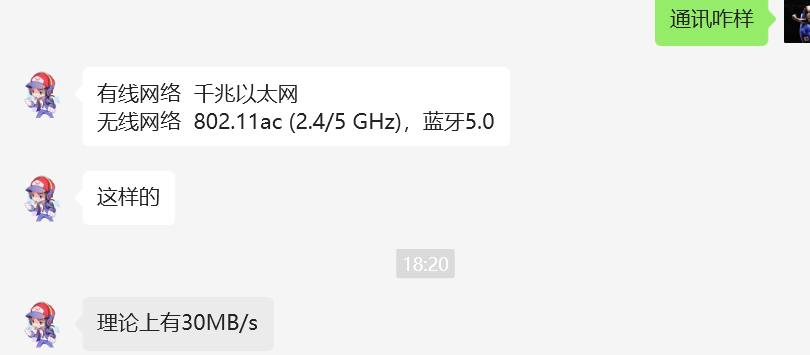
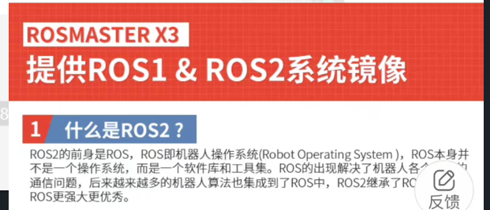
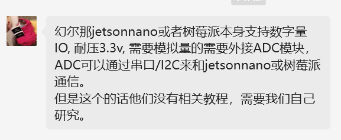
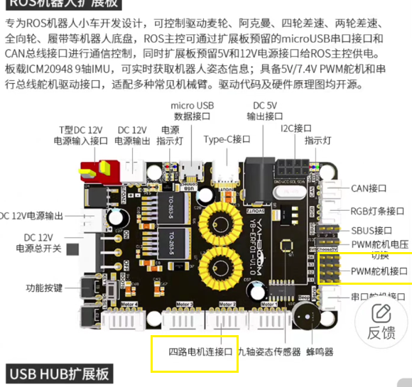

### 参数列表

**SOC Broadcom BCM2711**
**CPU 64-位1.5GHz四核(28nm工艺)**
**蓝牙 蓝牙5.0**
**GPU 500 MHz VideoCore VI**
**内存 1～ 4GB DDR4**
**影像输出 双micro HDMI端口**
**最大分辨率 4K 60 Hz +1080p或2x 4K 30 Hz**
**USB接口 2个USB 3.0/ 2x USB 2.0**
**有线网络 千兆以太网**
**无线网络 802.11ac (2.4/5 GHz)，蓝牙5.0**
**供电接口 USB Type-C**
**电力要求 3A，5V**
**多媒体 H.265(4Kp60 decode);**
**H.264 encode(1080p30/1080p60);**
**OpenGL ES,3.0 graphics\*\***

### 简介

1. 前后端通讯问题
   1. 理论上，无线网络传输速率可达30MB/s
2. 系统兼容性问题
   1. 商家都提供预装`ROS2`和`ubuntu20`的并且可以自己装系统升级
   2. docker 容器化几乎绝杀了环境问题
3. 可扩展性->电气控制问题
   1. 上位机和下位机都都有 `GPIO`这些常见的数字量信号，模拟量信号需要额外配置
   2. 脉冲信号(控制电机的)，应该是交给下位机的
