### 小车

> 预算2000-3000

#### 店铺选择

初选出三家稍微正规的公司商店 **幻儿**，**轮趣**，**亚博智能**

1. 幻儿 融资情况是**天使轮**，**2015**年成立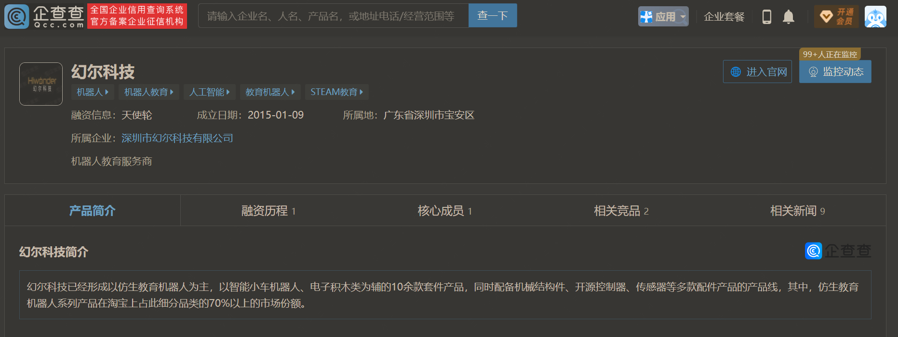
2. 亚博智能，2015年成立，注册资本533万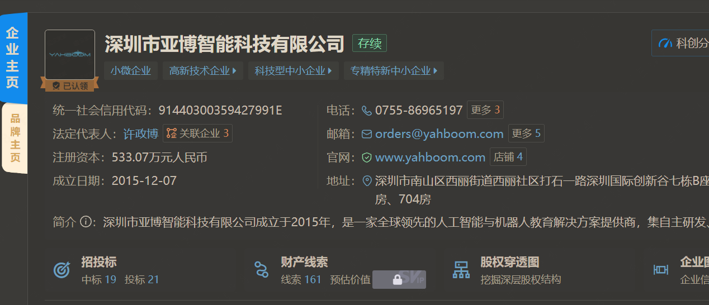
3. 轮趣 2018年成立，注册资本100万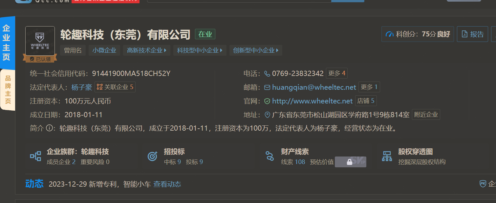

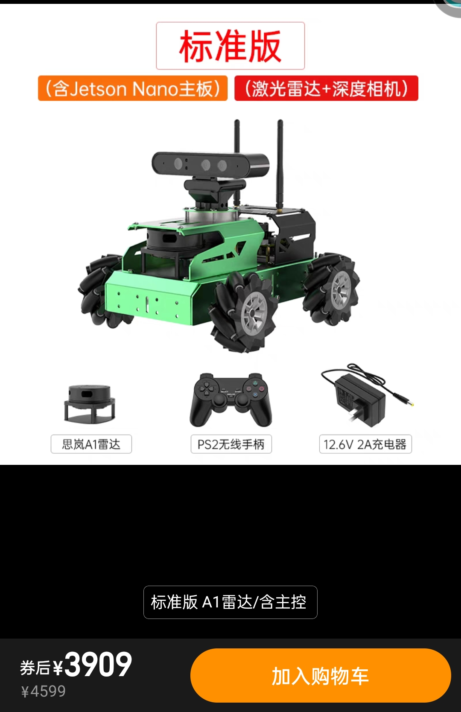

> 考虑 `ros主控`的时候，幻尔只有英伟达开发版，价格超过预算，直接排除
> 现在看这亚博智能和轮趣的

#### 型号参数

1. 相机全都是 Astra_Pro_Plus型号的，没什么争议,相关内容，相机文档在[camera](../../docs/device/camera.md)
   > 相机选择配套的 Astra_Pro_Plus，这没多少区别，两家一样
2. 上位机 轮趣科技 虽然有国产鲁班猫的选项并且价格与树莓派相差`300￥`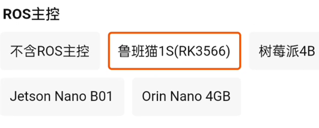，以及我们需要选购 经得起市场考验的产品，拥抱他们丰富的生态，树莓派是远近闻名的，**生态是重要的一方面**，[相关问题](../../docs/device/controller/Raspberry_PI_4B.md)树莓派已经都满足

   > ROS上位机选择 Raspberry_PI_4B，这没多少区别，两家一样

3. 左边是亚博智能，右边是轮趣的stm32 下位机开发板，明显亚博智能的板子看起来是自己改造过的，并且亚博智能的下位机可以单独购买

```
【淘宝】https://m.tb.cn/h.5rLh6GL?tk=z4xaWRxnIim CZ0001 「亚博智能 ROS机器人控制器ROS2小车IMU电机驱动STM32扩展板JETSON」
点击链接直接打开 或者 淘宝搜索直接打开
```

相对资料也更全面
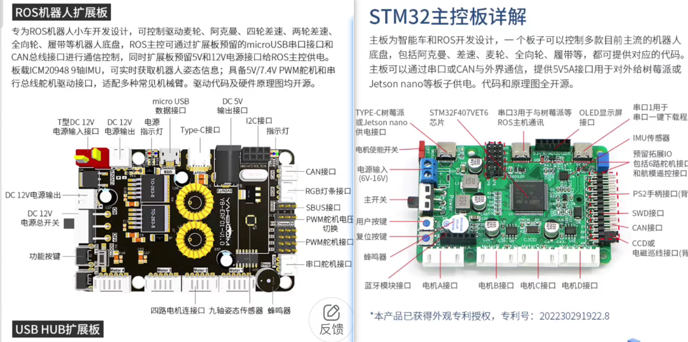

> 下位机是固定的 STM32 ，但是亚博智能更胜一筹

4. 底盘的区别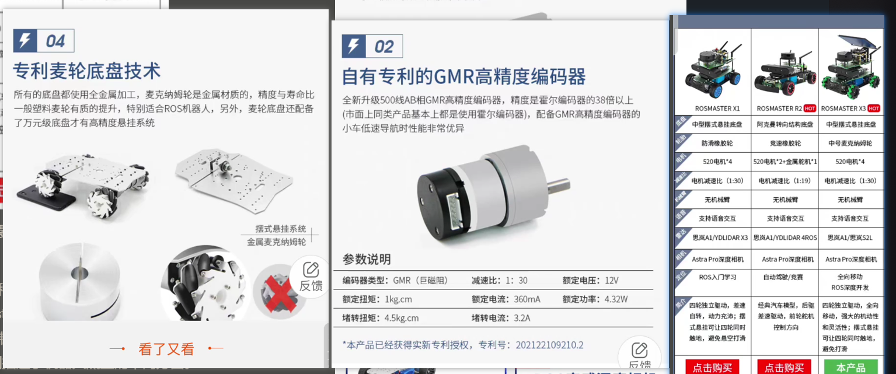左边两张是轮趣，右边是亚博智能，轮趣的底盘和轮子的的关注貌似更多，但我们如果是以视觉位置，小车运动精确度没那么高，相同配置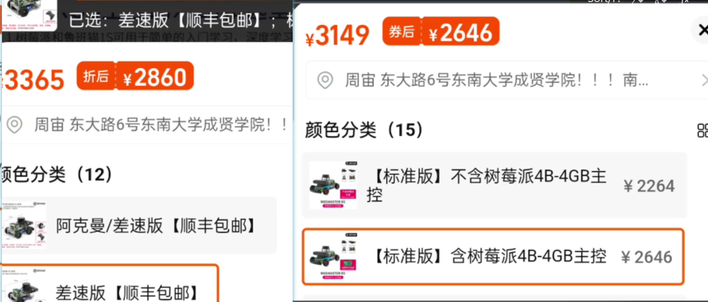轮趣会比亚博智能贵`2-300￥`

   > 底盘的较量上，亚博智能的可能更经济实惠
   > 底盘的类型上，一种接近于普通汽车->阿克曼转向结构，一种是悬挂式底盘->越野性能更好，适合不平的地面，看需求选择

5. 资源教程 [详情比较](../../docs/device/Tutorial_Comparison.md)

   > 售后和教程资源，亚博智能有独立的教程网站，以及技术客服专线

6. 具体的购买细节
   1. 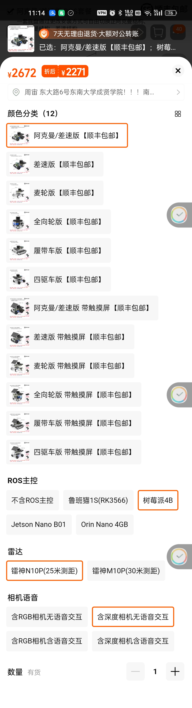轮趣科技的可以**减掉雷达的差价 `-300￥`，** **1900￥**可以拿到手
   2. 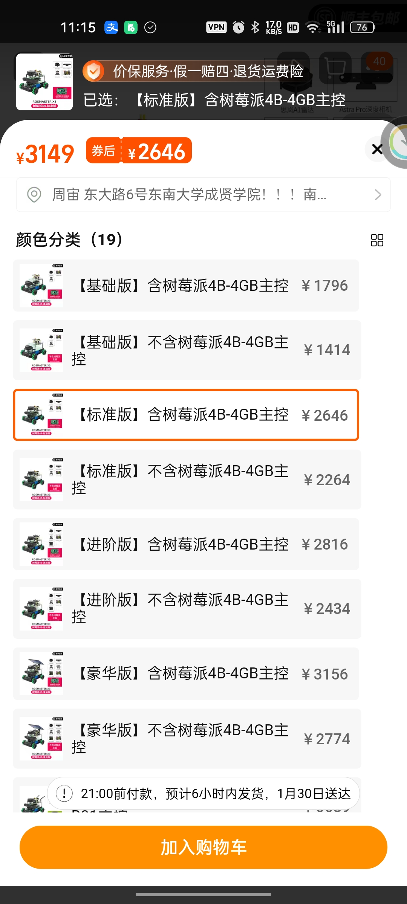亚博智能三个系列 x3型号的小车是购买人数最多的，评论也多，因此有人人能帮我们闭坑，但是由于在**做活动不能减差价**，要**2646￥**，从评论中得出没有活动应该是**4000￥左右**
   3. 顾客评论的情况，只看追评的话，都会有**匿名差评**，轮趣科技的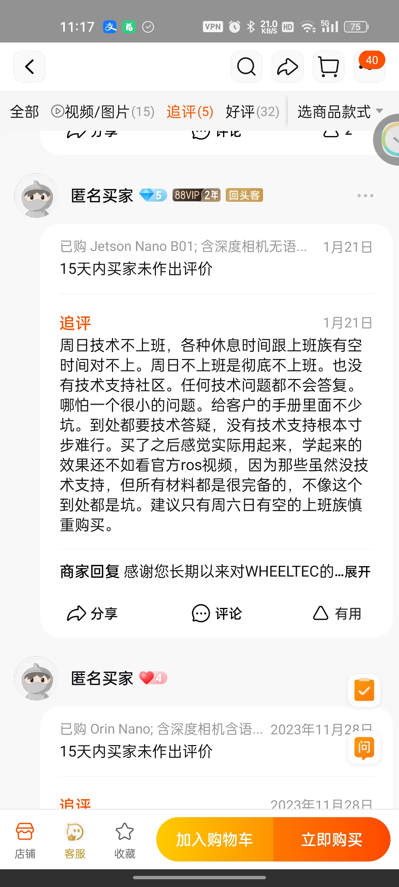，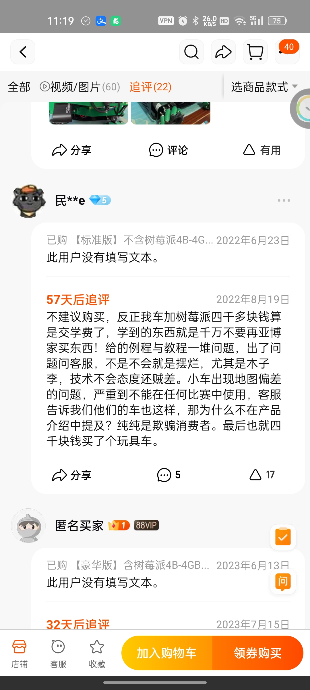综上看**不是明显的小车硬件故障**，有部分个人因素在里面，可能找的不是技术客服或者自己操作失误，轮趣科技的客服有点**推脱装死**，找不到人答疑，但亚博智能客服都是在的，**教程的质量可能会有问题**，毕竟不太可能天天跟着最新的资料走，已经全面的测试。
   4. 讨论好评的话，**非匿名**好评亚博智能更多，有本科生做实验的，买过去比赛的等等

**综上来看，亚博智能的X3较为合适**
ROSMASTER X3 的清单如下

