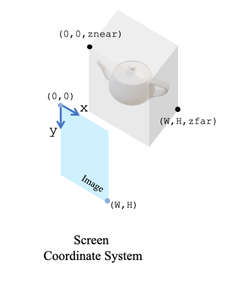
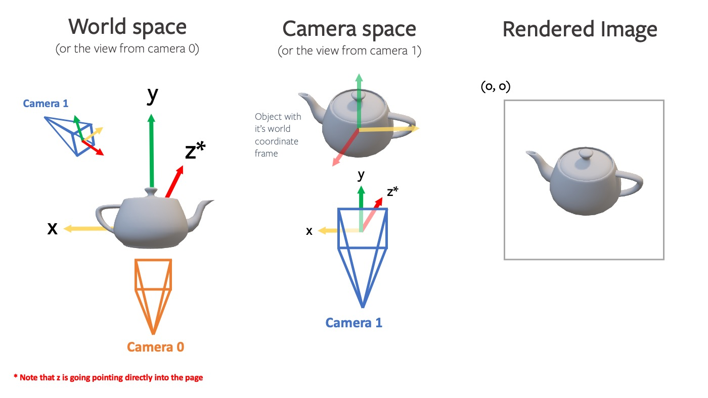

### image

_format in disk_

1. **JPEG（Joint Photographic Experts Group）**

- 采用有损压缩。
- 优点是可以在不显著降低视觉质量的情况下大幅减小文件大小，适用于存储照片。
- 缺点是重复保存和编辑会逐渐降低图像质量。

2. **PNG（Portable Network Graphics）**

- 采用无损压缩。
- 优点是保留原始图像的完整质量，支持透明度。
- 缺点是文件大小通常比JPEG大。
  _format in RAM_

#### Image coordinate system


图像坐标系中：

- **原点**（0, 0）位于图像的左上角。
- **X轴**的正方向是向右，表示图像的宽度（w)方向。
- **Y轴**的正方向是向下，表示图像的高度（h）方向。
  _reason_
  这种坐标系统选择主要是基于图像数据在计算机内存中的存储方式。在大多数图像处理库和图形界面系统中，图像数据是按行存储的，每行从左到右，行从上到下排列。因此，图像的第一个像素（位于左上角）对应于坐标（0, 0）。

#### color

1. channel first and RGB(red, green, blue)->pytorch,etc

```python
image.shape = (RGB,Height,Weight)
```

2. channel not first and BGR(blue,green,red) for opencv,etc

```python
image.shape = (Height,Weight,BGR)
```

- **normalize**

```python
image/255.
[0,255] -> [0,1.0]
```

#### depth

1. raw depth data from `.png` with shape(h,w)

```python
depth_image = cv2.imread('depth_image.png', cv2.IMREAD_GRAYSCALE)
```

2. expand_dims for `pytorch`

```python
depth_tensor.unsqueeze(0)
shape->(1,h,w)
```

### camera

> [cameras · PyTorch3D](https://pytorch3d.org/docs/cameras)

#### camera coordinate system

**相机坐标系**：
一个随相机位置和朝向改变的参考系。在相机坐标系中，原点位于相机的位置，通常Z轴与相机的视线方向对齐，X轴和Y轴分别与相机成横轴和纵轴对齐。
**世界坐标系**：
一个固定的、全局的参考系，通常用来描述场景中物体的位置。在这个坐标系下，每个物体的位置都是相对于一个固定点（世界原点）来定义的。

#### Intrinsic Matrix

**内参矩阵**

- **`fx​`** 和 **`fy`​**：分别是相机在图像平面x轴和y轴方向上的焦距，用像素值表示。焦距反映了镜头对场景的放大程度。在理想情况下，对于方形像素，`fx​` 和 `fy`​ 应该是相同的，但由于镜头畸变和制造公差，它们可能略有不同。
- **`cx`​** 和 **`cy`​**：是图像的主点（principal point）坐标，也就是图像坐标系统原点在图像平面上的位置。通常，这个点被假定为图像的中心，但实际上可能会由于镜头制造和装配不精确而有所偏移。
  通常作为相机内参矩阵`K`
  $$\left.K=\left[\begin{array}{ccc}f_x&0&c_x\\0&f_y&c_y\\0&0&1\end{array}\right.\right]$$

#### Extrinsic Matrix

**外参矩阵**

- 描述了相机在全局空间（或称为世界坐标系）中的位置和方向。
  $$E_t=\begin{bmatrix}R&\mathbf{t}\end{bmatrix}$$
- **旋转（Rotation）**：通过`3x3`的旋转矩阵部分，可以围绕原点执行物体的旋转操作。旋转可以是绕`X`轴、`Y`轴或`Z`轴的单轴旋转，也可以是这些旋转的任意组合。
- **平移（Translation）**：通过`Tx`, `Ty`, `Tz`三个元素，可以将物体在三维空间中沿各个方向移动。
  > 在实践中，为了同时处理旋转和平移，我们通常使用`4x4`的齐次坐标变换矩阵。这允许我们通过单一的矩阵乘法来执行整个变换操作，从而简化了计算。

#### Homogeneous coordinate transformation matrix

**齐次坐标变换矩阵**
$$\mathbf{M}_{\mathrm{c2w}}=\begin{bmatrix}R&T\\0&1\end{bmatrix}$$

- **$R$（旋转矩阵）**：描述了相机坐标系的基向量（即相机的前向、上方和右侧方向）如何相对于世界坐标系进行旋转对齐。因此，$R$实际上定义了相机坐标系的朝向相对于世界坐标系的朝向。

- **$T$（平移向量）**：表示相机坐标系的原点（可以理解为相机的光心或中心）在世界坐标系中的位置。换言之，$T$描述了从世界坐标系的原点到相机坐标系原点（相机的位置）的直线距离和方向。

因此可以把相机坐标系中的任意一点转换为世界坐标系中的对应点，该过程包括将点首先通过$R$旋转到正确的朝向，然后通过$T$平移到正确的位置。

对于把$P_w$转化为 $P_c$，依赖于$\mathbf{M}_{\mathrm{w2c}}$,而且可以通过逆变换得到$\mathbf{M}_{\mathrm{w2c}}=\mathbf{M}_{\mathrm{c2w}}^{-1}$

> 轨迹文件`traj.txt`,每行是一个`4*4`的变换矩阵，变量名常作`c2w`

```text
R11 R12 R13 Tx
R21 R22 R23 Ty
R31 R32 R33 Tz
 0   0   0  1
```

$\mathbf{M}_{\mathrm{w2c}}$ 变量名常作`w2c`

#### Projection Transform Matrix

#### Coordinate transformation during imaging

**成像过程中的坐标变换**

当我们讨论将三维世界坐标系中的点投影到二维图像平面时，需要进行坐标变换，包括：

1. **从世界坐标系到相机坐标系**：这一步使用齐次坐标形式的外参矩阵$\mathbf{M}_\mathrm{w2c}=\begin{bmatrix}R&T\\0&1\end{bmatrix}$，给定$P_w=(X_w,Y_w,Z_w,1)^T$ 变换$\begin{aligned}\mathbf{P}_c=(X_c,Y_c,Z_c)^T\end{aligned}$
   $$\mathbf{P}_c=\mathbf{M}_{\mathrm{w2c}}\cdot\mathbf{P}_w$$
2. **从相机坐标系到图像平面**：这一步使用内参矩阵$K$，将$\begin{aligned}\mathbf{P}_c=(X_c,Y_c,Z_c)^T\end{aligned}$投影到二维图像平面像素点$P_i=(u,v)$
   $$\mathbf{P}_i=\mathbf{K}\cdot\begin{bmatrix}X_c\\Y_c\\Z_c\end{bmatrix}/Z_c$$

### 3DGS
