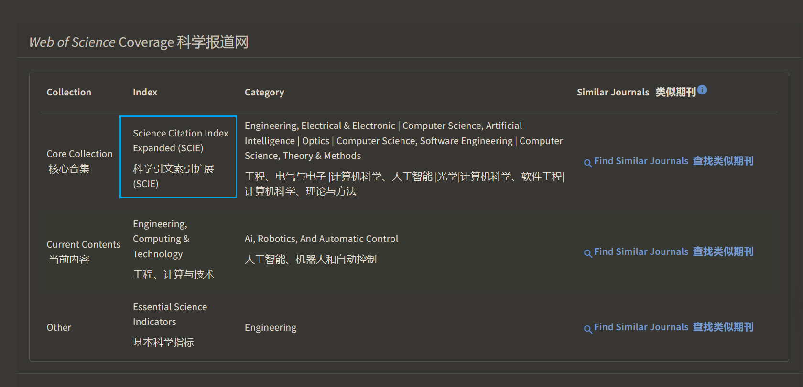

### 查期刊属于SCI的分区

[科学网—三种方法教你如何查看期刊的SCI分区 - 刘承南的博文](https://blog.sciencenet.cn/blog-3511108-1345011.html)

### 查是否为sci收录

[Web of Science Master Journal List - WoS MJL by Clarivate](https://mjl.clarivate.com/home)
比如**IMAGE AND VISION COMPUTING**
，**SCI**或者*SCIE*
