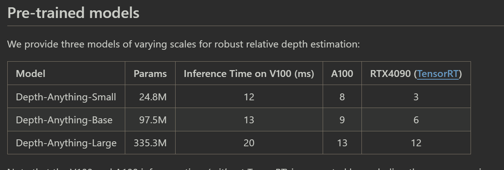
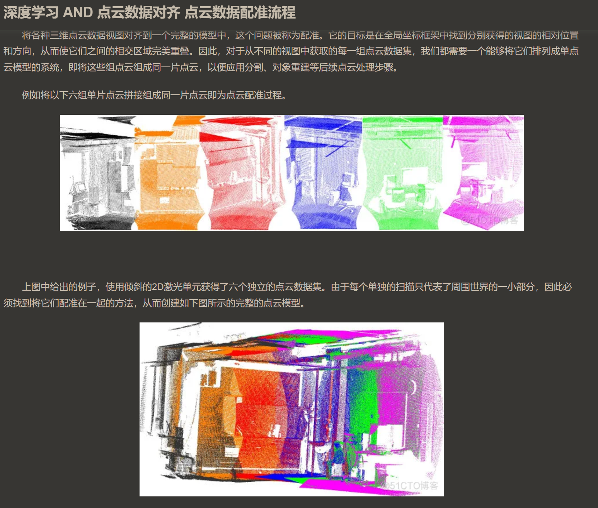

## basic knowledge

### nerf

#### 模型概述

`nerf` 模型可以理解为三位重建的深度学习模型，给定空间位置`x,y,x`和观察方向`方向向量`,输出该位置的`RPG`和体积密度\(表示空间的透明度)

#### 训练NeRF模型所需信息

1. **彩色图像**：NeRF通过对一系列从不同视角拍摄的彩色图像进行训练，学习场景的3D表示。
2. **相机参数**：传统的NeRF模型训练需要知道每张图像对应的相机参数，包括相机的位置、朝向（姿态）和内参（焦距、光心等）。这些参数用于将3D场景映射到2D图像平面，帮助模型理解不同视角下观察到的场景变化。

### RPG图像

彩色图像，除了长宽之外，可以描述这张图有多少个点，还要描述每个点的颜色，那么颜色使用三原色表示，也就是常见的三色通道，范围一般是`0-255`

### 深度图像

这个变成单通道了，范围不清楚，但是每个像素点变成了描述距离的远近

## essay

1. [nopo-nerf](../../docs/papers/nopo-nerf.pdf)
   2024-02-16
   这是牛津大学提出的，一种更适用于现实环境中的`nerf`方案。

因为使用nerf三位重建需要相机位置参数，对于`meta`给的数据集，他们有提前提供的相机姿态信息，但是显示中，随手拍摄的视频，不仅无法提供精确的相机姿态信息，即使可以预先硬件测量，也可能会出现大量的晃动，导致姿态参数不稳定，无法高效的重建。

解决方案
大概是将相机姿态参数作为**待优化**的变量，将深度图像作为损失函数的一种，避免了特别依赖相机参数的问题，并且模型也学会了估计位置

问题
但是没有透露实时性好，基本上就是说计算量很大。。。用不了2. [neuralrecon](../../docs/papers/neuralrecon.pdf)
应该是浙大的研究，主要是根据相机参数和`rpg`生成那种只有表面的空间结构，性能很强，但是必须提供相机参数。。。

可能的应用
如果点云重建的效果不好，可以根据点云对齐推算的位置作为初始参数使用这个方法用rpg进行三位表面重建，对于机器人来说，空间了解表面基本上够了，并且该方法的精度还可以的

## solution

### 3-d reconstruction

2024-02-16
_怎么重建？_
有深度图像就可以直接生成点云，重点关注19年时候英特尔开源的点云处理库`open3d`这是现有的正常维护中的库，有深度图就可以实现点云的三维重建了
_没有深度图像咋办？或者深度图像质量不高咋办?_
[GitHub - LiheYoung/Depth-Anything: Depth Anything: Unleashing the Power of Large-Scale Unlabeled Data. Foundation Model for Monocular Depth Estimation](https://github.com/LiheYoung/Depth-Anything)

现在已经有了直接从`RPG`转化成深度图像的模型了，根据他的模型参数，性能是非常好的，可以直接接近实时

### loaclization

2024-02-16
_怎么解决定位问题？_
只要实现了点云构造，对连续帧深度图生成的点云图像进行 **对齐**，就可以直接推算出相机的位置参数，`open3d`应该是有成熟的点云对齐函数[open3d.registration.GlobalOptimizationGaussNewton — Open3D 0.6.0 documentation](https://www.open3d.org/docs/0.6.0/python_api/open3d.registration.GlobalOptimizationGaussNewton.html)

直接构建不需要定位，或者说从点云对齐得到的连续帧率得到的相对运动信息可以辅助加速点云对齐

初始全局定位可能会麻烦一点，要全局搜索？或者开始粗略几个初始点，然后根据移动，后续连续帧的一系列信息才开始定位，精确空间定位需要仔细设计
### planning

2024-02-16
_导航的地图怎么办，以及导航方法？_

1. 可以将点云数据转化成二位的`占用网格`，传统路径规划算法
2. 或者至今在三维空间实现空间路径规划，可能要找找最新的，香港科技大学，GitHub仓库里面好像是有类似的，是关于无人机的
