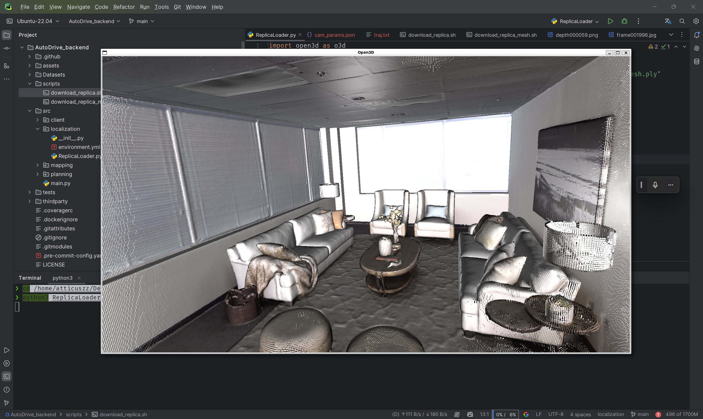

## TODO

## in process

- [ ] _all_<br> 尝试使用jet Brians的gate way的pycharm连接wsl,打开自己克隆的[GitHub - SupaVision/AutoDrive_backend](https://github.com/SupaVision/AutoDrive_backend.git)项目到本地<br> 使用命令行安装`/../AutoDrive_backend/src/localization`项目路径下的conda环境，并且在该目录下面运行`python3 ReplicaLoader.py`,运行之前记得下载meta的数据集`/AutoDrive_backend/scripts/download_replica.sh`<br> 实际效果
- [x] _zzy_ 2024-03-02 尝试使用windows平台的SDK软件包连接相机并做一些简单的尝试      2024-03-03 更新了关于 wsl 中身份验证问题的文档
- [ ] _zzy_ ...
- [ ] _zz_ 2024-03-02 尝试连接树莓派

## Done

- [x] _teacher_ 2024-03-02重新安装最新的win11分发版，解决了wsl无法安装的问题
- [x] @2024-01-27 _all_ 确定小车选型<br> 详情见[purchase](../../docs/device/purchase.md)
- [x] @{2024-02-26}_all_ 安装`wsl` 和`ubuntu`还有基本环境的配置项1.基础系统工具， <br>2.python=3.11， <br>3.python环境poetry，miniconda， <br>4.vscode连接ubuntu, 5.如果有英伟达GPU安装`cuda`<br>[.../../docs/OS/Ubuntu/configs.md](../../docs/OS/Ubuntu/configs.md)
- [x] @2024-2-20 _all_ 安装好了1.安装好clash配置好网络代理2.配置好git 3.成功使用obsidian打开Dochub

%% kanban:settings

```
{"kanban-plugin":"basic"}
```

%%
