## 使用说明

test

### 这个仓库是什么？

- 这个仓库如其名，是基于git+github+obsidian的知识仓库，用于共享学习过程中的资料文件，或者相关项目的资料，或者作为其他项目仓库的集中导航入口

### 如何使用？

_默认都是windows 64位系统_

#### 直接访问仓库

- **docs文件**夹下都是共享文档，其余文件夹都是自动化脚本等等配置，有兴趣可以研究，可以直接浏览他们
- **如何上传文件？**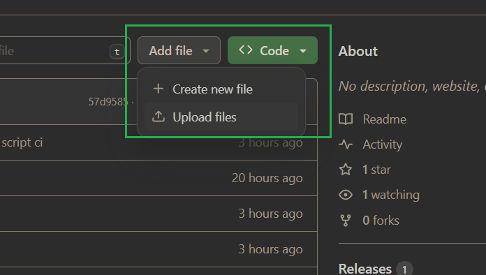
- **如何下载？**
  - 就像访问自己电脑文件夹一样访问docs中的文件，找到想下载的文件图中按钮下载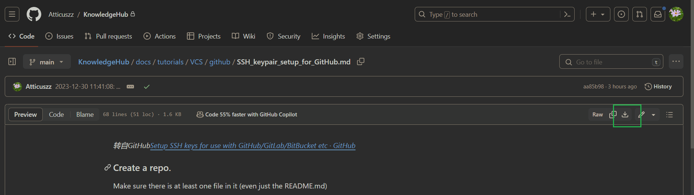

#### 配合本地仓库使用

_git是预先配置_

- git
  - 是什么？
    - **版本控制系统**\(_是一种记录一个或若干文件内容变化，以便将来查阅特定版本修订情况的系统_\)核心工具
  - 干嘛要装它？
    - 这样，你得任何对指定目录下的文件都会被检测到，一旦commit(提交当前更改)，push(推送到GitHub云端)，obsidian+git插件会自动同步云端其他协作者的修改，这就达到了共同协作
  - 怎么安装？
    - [下载链接](https://git-scm.com/download/win) （选这**64-bit Git for Windows Setup.** 这个)
    - [安装指导](../../docs/tutorials/basic_tools/git-install-instruction.md)
  - 安装完之后如何下载github仓库？
    - 克隆仓库命令，选择[你合适的目录下打开命令行](../../docs/tutorials/shell/CMD.md)或者执行他
- https _网速太慢，考虑[开启代理](../../docs/tutorials/VCS/git.md)，代理也不行，考虑ssh_

```bash
git clone https://github.com/Atticuszz/KnowledgeHub.git
```

- ssh _需要给自己的计算机和[GitHub账户配置额外的密钥](../../docs/tutorials/VCS/github/SSH_keypair_setup_for_GitHub.md),速度更快_

```bash
git clone git@github.com:Atticuszz/KnowledgeHub.git
```

下载完毕之后，你可以使用想往常访问文件夹一样访问

#### 结合本地应用使用

- Pycharm _git需要完成[基本配置](../../docs/tutorials/VCS/git.md)才可进行推送_

  - 是什么？
    - jetbrains系列的IDE(集成开发环境)，适用于python和常见前端框架vue,reat等等
  - 为什么使用它？
    - 因为他是IDE,常见配套的VCS工具很全面，包括**git clone**,**git commit,git push**,常见的命令都有图形化界面,_避免频繁的输入命令行_
  - 如何使用它克隆仓库？
    - 找到从版本控制获取，英文应该是 from VCS，输入仓库链接就可以了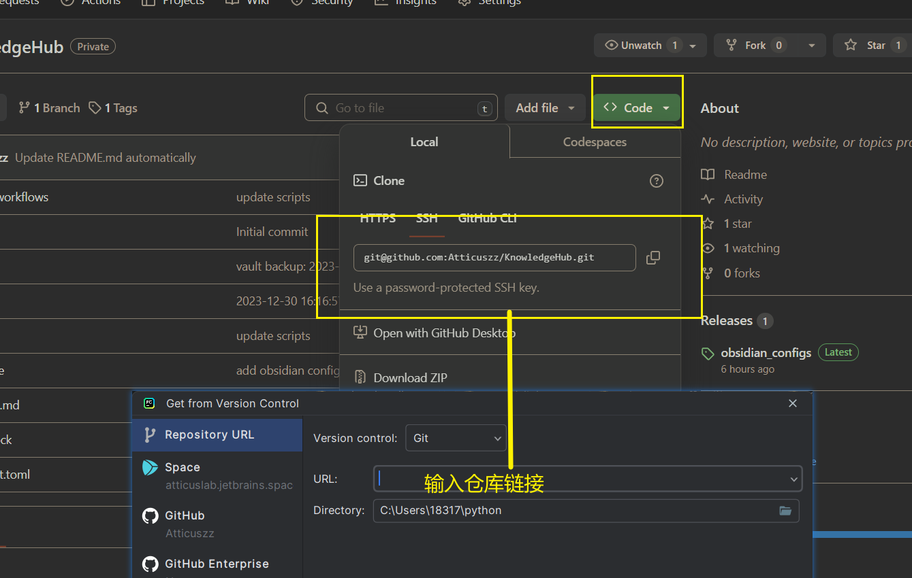
  - 如何推送到github，而不是手动上传内容
    - 先提交更改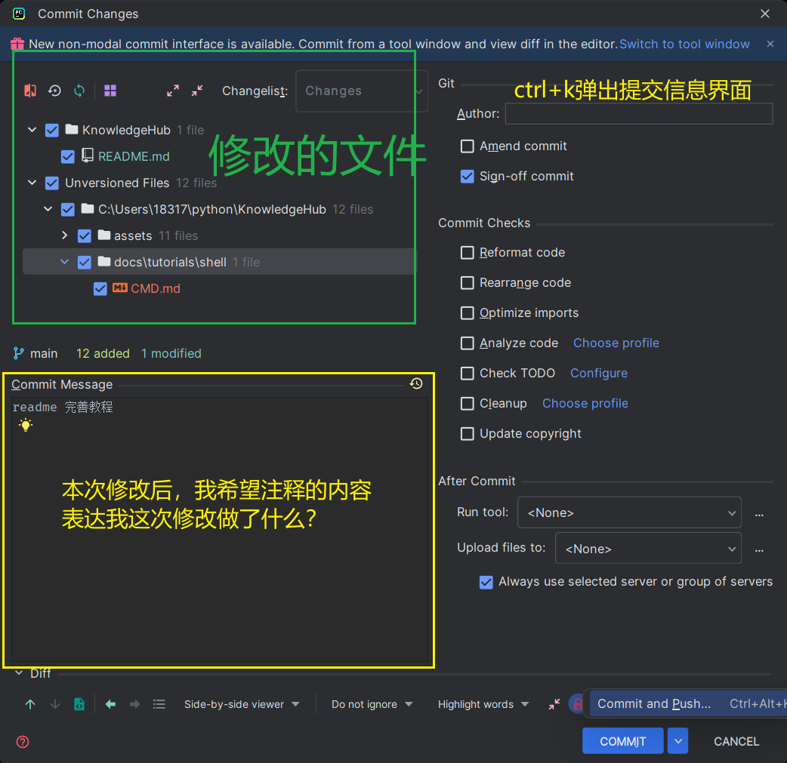
    - 再推送到GitHub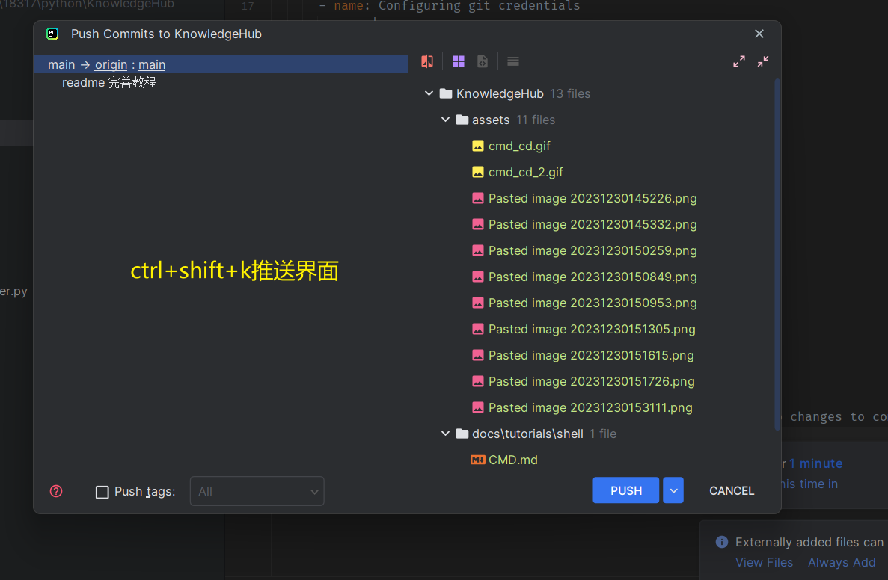
  - 如何从github自动更新收到内容？
    - 菜单栏的拉取操作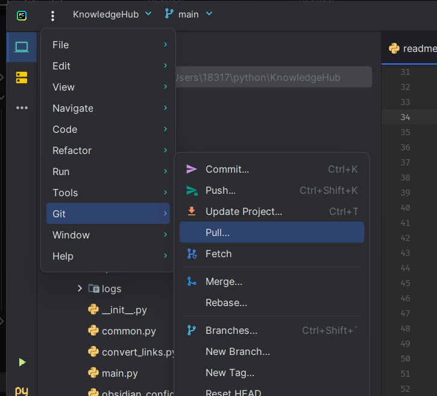
    - 或者安装[GitToolBox - IntelliJ IDEs Plugin | Marketplace](https://plugins.jetbrains.com/plugin/7499-gittoolbox)插件，会自动fetech最新的内容，安装后大概在底部菜单栏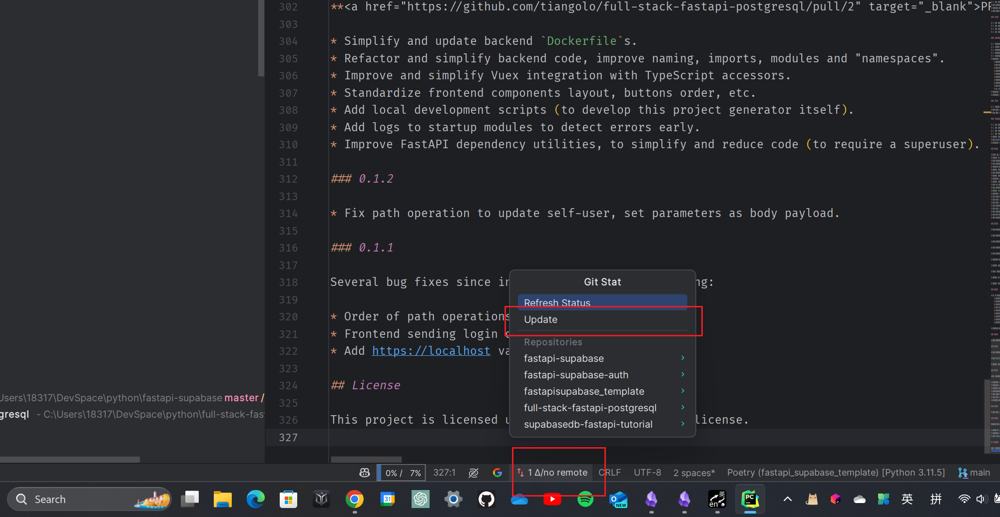
  - 优缺点？
    - 优点是，比较全面的图形化界面管理git和GitHub
    - 缺点是，ide占用比较多的系统资源，不是游戏本会比较吃力

- obsidian
  - 是什么？
    - 是一个笔记知识库管理软件(主要是.md文件，也可以有其他文件pdf之类的)，基于Electron框架编写，有着庞大的生态，因此有各种各样的插件可以解决软件使用过程中的一些小需求，比如obsdian-git插件这就让obsidian可以进行基于GitHub的多人协作，备份文档
  - 怎么安装？
    - [Download - Obsidian](https://obsidian.md/download)
    - 安装完毕之后先不要创建仓库
  - 导入预先配置
    - release页面下载配置文件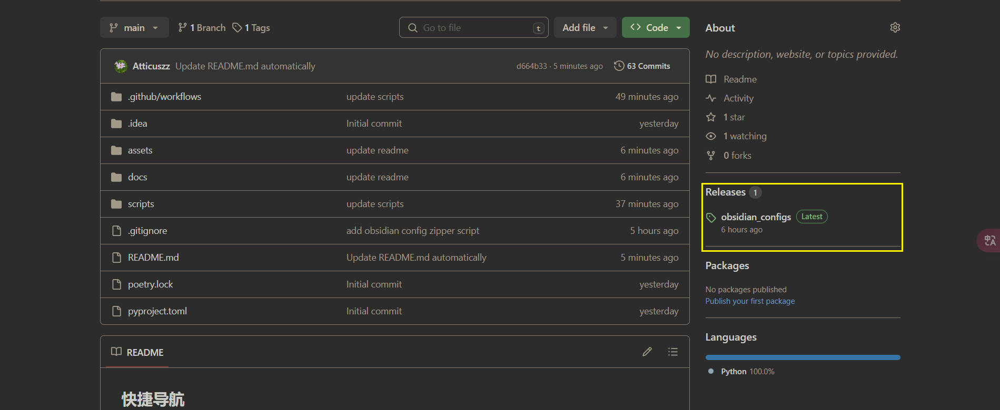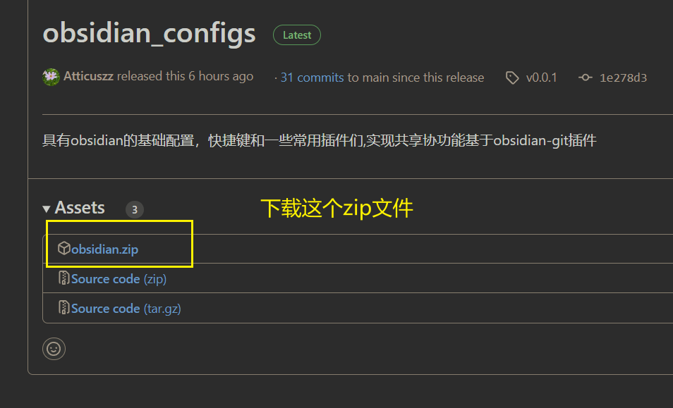
    - 你到期望的目录下，命令行运行仓库克隆命令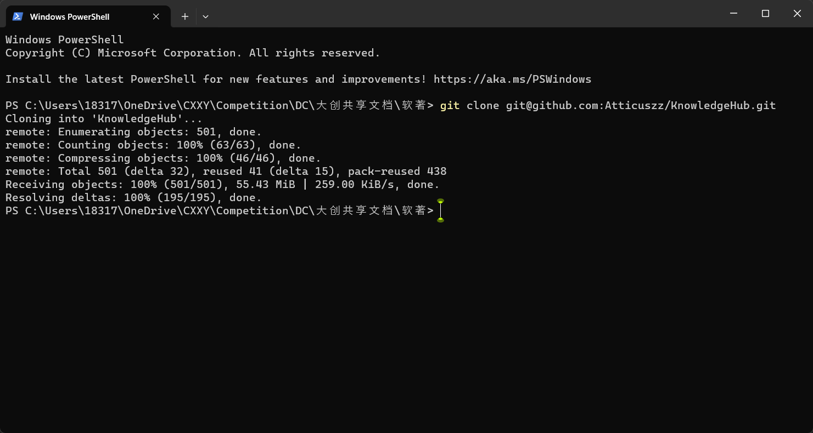
    - 将obsidian.zip解压到克隆本地仓库的目录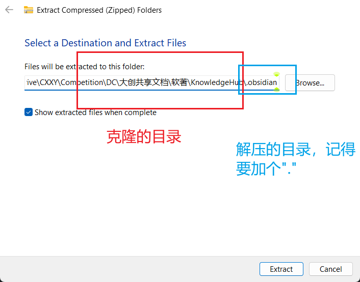解压完记得**删除zip**,最终效果如图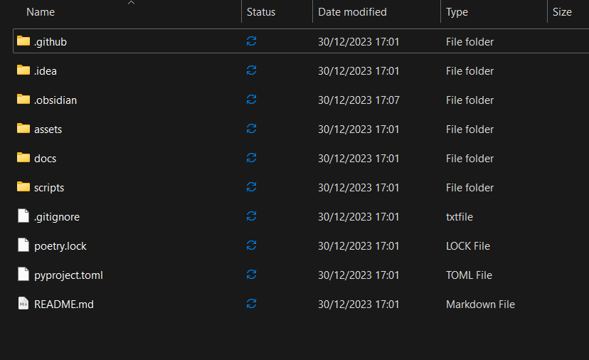，这样你的仓库和obsidian配置文件就导入完成了
    - 选择你克隆的目录地址打开它
  - 如何提交更改？
    - 先 **ctrl+alt+s**，打开右侧的资源面板，会显示最近修改的文件，点击它可以查看文件修改的具体细节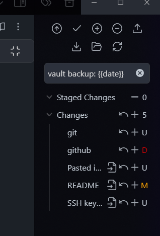
    - 根据最近的修改，撰写一条提交信息，用于指示，你这次做了哪些改动，按下**ctrl+k** 会会弹出来一个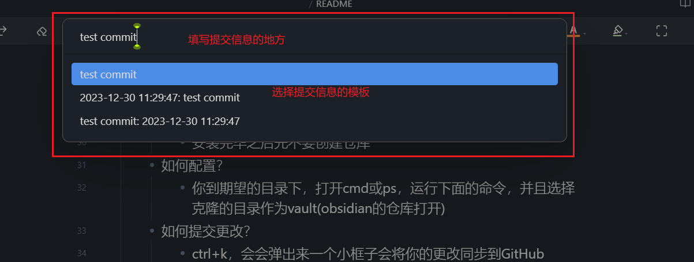选择提交信息之后，obsidian-git会将你的更改推送到GitHub仓库
  - 如何同步？
    - 初次打开obsidian或者每五分钟，或者ctrl+alt+p,都会自动同步内容
    -

_如果是使用obsidian，同步内容只需要快捷键或者设置obsidian-git插件自动推送_
**同步内容共享内容不费吹灰之力**

- 有多丝滑？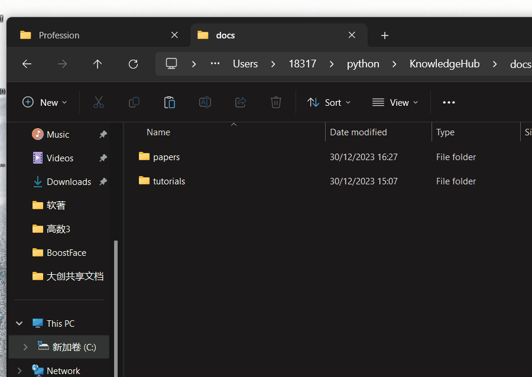复制到docs中的文件，ctrl+k填写提交信息，一键推送GitHub
- github action
  - 自动化脚本执行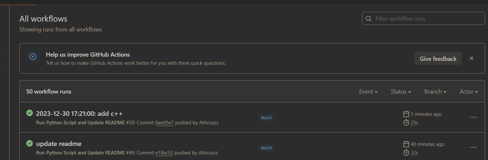自动生成docs的目录快捷入口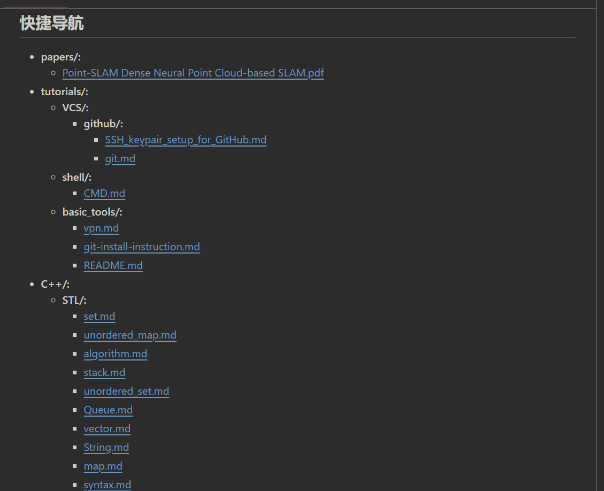
  - 自动生成docs的最近修改情况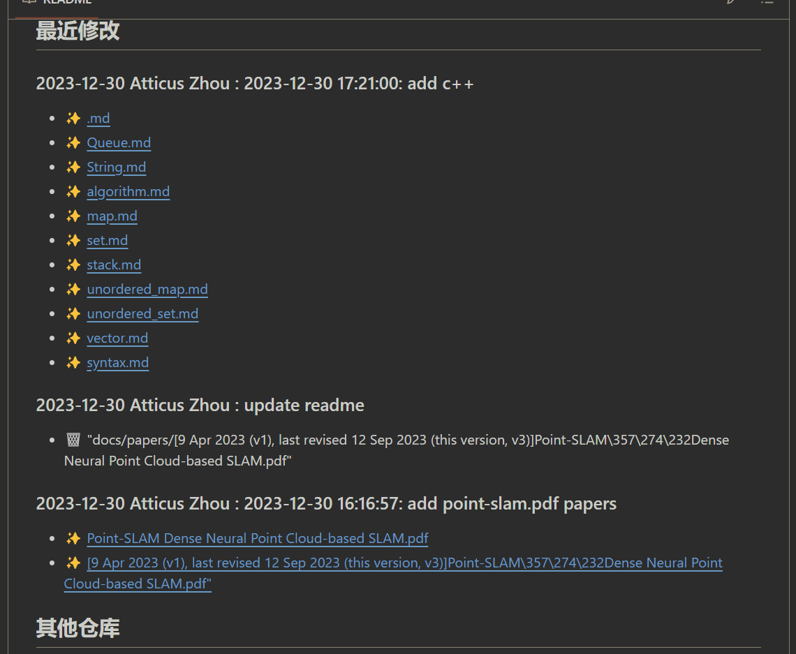
