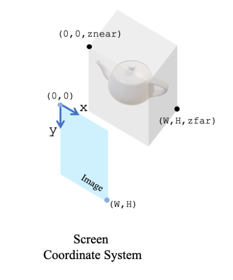
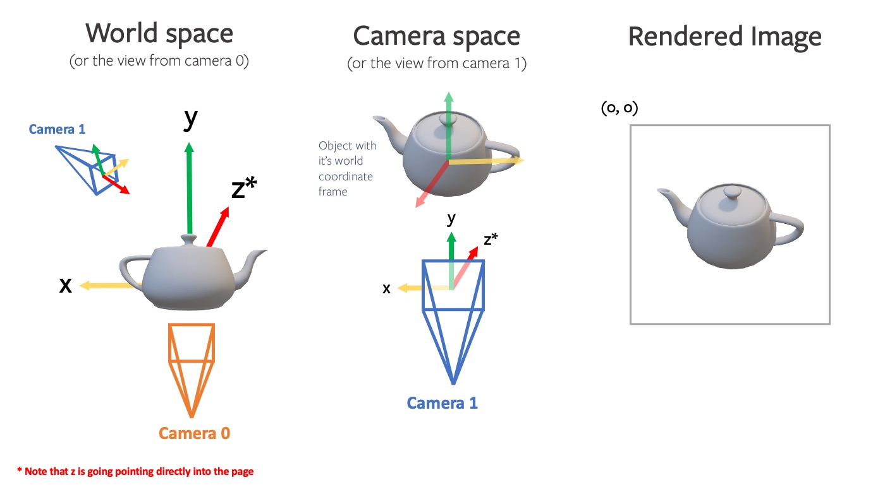

### image

_format in disk_

1. **JPEG（Joint Photographic Experts Group）**

- 采用有损压缩。
- 优点是可以在不显著降低视觉质量的情况下大幅减小文件大小，适用于存储照片。
- 缺点是重复保存和编辑会逐渐降低图像质量。

2. **PNG（Portable Network Graphics）**

- 采用无损压缩。
- 优点是保留原始图像的完整质量，支持透明度。
- 缺点是文件大小通常比JPEG大。

_format in RAM_

#### Image coordinate system


图像坐标系中：

- **原点**（0, 0）位于图像的左上角。
- **X轴**的正方向是向右，表示图像的宽度（w)方向。
- **Y轴**的正方向是向下，表示图像的高度（h）方向。
  _reason_
  这种坐标系统选择主要是基于图像数据在计算机内存中的存储方式。在大多数图像处理库和图形界面系统中，图像数据是按行存储的，每行从左到右，行从上到下排列。因此，图像的第一个像素（位于左上角）对应于坐标（0, 0）。

#### color

1. channel first and RGB(red, green, blue)->pytorch,etc

```python
image.shape = (RGB,Height,Weight)
```

2. channel not first and BGR(blue,green,red) for opencv,etc

```python
image.shape = (Height,Weight,BGR)
```

- **normalize**

```python
image/255.
[0,255] -> [0,1.0]
```

#### depth

1. raw depth data from `.png` with shape(h,w)

```python
depth_image = cv2.imread('depth_image.png', cv2.IMREAD_GRAYSCALE)
```

2. expand_dims for `pytorch`

```python
depth_tensor.unsqueeze(0)
shape->(1,h,w)
```

### camera

> [cameras · PyTorch3D](https://pytorch3d.org/docs/cameras)

#### camera coordinate system

**相机坐标系**：
一个随相机位置和朝向改变的参考系。在相机坐标系中，原点位于相机的位置，通常Z轴与相机的视线方向对齐，X轴和Y轴分别与相机成横轴和纵轴对齐。
**世界坐标系**：
一个固定的、全局的参考系，通常用来描述场景中物体的位置。在这个坐标系下，每个物体的位置都是相对于一个固定点（世界原点）来定义的。

#### Intrinsic Matrix

**内参矩阵**
[Camera Intrinsic Matrix with Example in Python | by Neeraj Krishna | Towards Data Science](https://towardsdatascience.com/camera-intrinsic-matrix-with-example-in-python-d79bf2478c12)

- **`fx​`** 和 **`fy`​**：分别是相机在图像平面x轴和y轴方向上的焦距，用像素值表示。焦距反映了镜头对场景的放大程度。在理想情况下，对于方形像素，`fx​` 和 `fy`​ 应该是相同的，但由于镜头畸变和制造公差，它们可能略有不同。
- **`cx`​** 和 **`cy`​**：是图像的主点（principal point）坐标，也就是图像坐标系统原点在图像平面上的位置。通常，这个点被假定为图像的中心，但实际上可能会由于镜头制造和装配不精确而有所偏移。
  通常作为相机内参矩阵`K`
 $$\left.K=\left[\begin{array}{ccc}f_x&0&c_x\\0&f_y&c_y\\0&0&1\end{array}\right.\right]$$

#### Extrinsic Matrix

**外参矩阵**
[Camera Extrinsic Matrix with Example in Python | by Neeraj Krishna | Towards Data Science](https://towardsdatascience.com/camera-extrinsic-matrix-with-example-in-python-cfe80acab8dd)

- 描述了相机在全局空间（或称为世界坐标系）中的位置和方向。
 $$E_t=\begin{bmatrix}R&\mathbf{t}\end{bmatrix}$$
- **旋转（Rotation）**：通过`3x3`的旋转矩阵部分，可以围绕原点执行物体的旋转操作。旋转可以是绕`X`轴、`Y`轴或`Z`轴的单轴旋转，也可以是这些旋转的任意组合。
- **平移（Translation）**：通过`Tx`, `Ty`, `Tz`三个元素，可以将物体在三维空间中沿各个方向移动。
  > 在实践中，为了同时处理旋转和平移，我们通常使用`4x4`的齐次坐标变换矩阵。这允许我们通过单一的矩阵乘法来执行整个变换操作，从而简化了计算。

#### Homogeneous coordinate transformation matrix

**齐次坐标变换矩阵**
$$\mathbf{M}_{\mathrm{c2w}}=\begin{bmatrix}R&T\\0&1\end{bmatrix}$$

- **$R$（旋转矩阵）**：描述了相机坐标系的基向量（即相机的前向、上方和右侧方向）如何相对于世界坐标系进行旋转对齐。因此，$R$实际上定义了相机坐标系的朝向相对于世界坐标系的朝向。

- **$T$（平移向量）**：表示相机坐标系的原点（可以理解为相机的光心或中心）在世界坐标系中的位置。换言之，$T$描述了从世界坐标系的原点到相机坐标系原点（相机的位置）的直线距离和方向。

因此可以把相机坐标系中的任意一点转换为世界坐标系中的对应点，该过程包括将点首先通过$R$旋转到正确的朝向，然后通过$T$平移到正确的位置。

对于把$P_w$转化为$P_c$，依赖于$\mathbf{M}_{\mathrm{w2c}}$,而且可以通过逆变换得到$\mathbf{M}_{\mathrm{w2c}}=\mathbf{M}_{\mathrm{c2w}}^{-1}$

> 轨迹文件`traj.txt`,每行是一个`4*4`的变换矩阵，变量名常作`c2w`

```text
R11 R12 R13 Tx
R21 R22 R23 Ty
R31 R32 R33 Tz
 0   0   0  1
```

$\mathbf{M}_{\mathrm{w2c}}$变量名常作`w2c`

#### Projection Transform Matrix

#### Coordinate transformation during imaging

**成像过程中的坐标变换**

当我们讨论将三维世界坐标系中的点投影到二维图像平面时，需要进行坐标变换，包括：

1. **从世界坐标系到相机坐标系**：这一步使用齐次坐标形式的外参矩阵$\mathbf{M}_\mathrm{w2c}=\begin{bmatrix}R&T\\0&1\end{bmatrix}$，给定$P_w=(X_w,Y_w,Z_w,1)^T$变换$\begin{aligned}\mathbf{P}_c=(X_c,Y_c,Z_c)^T\end{aligned}$
  $$\mathbf{P}_c=\mathbf{M}_{\mathrm{w2c}}\cdot\mathbf{P}_w$$
2. **从相机坐标系到图像平面**：这一步使用内参矩阵$K$，将$\begin{aligned}\mathbf{P}_c=(X_c,Y_c,Z_c)^T\end{aligned}$投影到二维图像平面像素点$P_i=(u,v)$
  $$\mathbf{P}_i=\mathbf{K}\cdot\begin{bmatrix}X_c\\Y_c\\Z_c\end{bmatrix}/Z_c$$

### Point Cloud

#### pixel to Point cloud
$$
\mathbf{p} = \begin{bmatrix} \frac{u - c_x}{f_x} d \\ \frac{v - c_y}{f_y} d \\ d \end{bmatrix}, \quad d = \frac{I_d(u, v)}{s}
$$

#### estimate c2w

**估计相机坐标系到世界坐标系的姿态变换矩阵**

##### ICP(p2p)

_迭代最近点-point to point_
_数学模型_

- **目标函数**：
  - ICP 旨在最小化点云间的欧氏距离之和，通常通过解决最小二乘问题实现：
  -$$\min*T \sum*{i=1}^N \| R p*i + \mathbf{t} - q*{\text{closest}(i)} \|^2$$
- **求解方法**：
  - 使用 SVD (奇异值分解) 或其他数值方法求解$R$和$\mathbf{t}$。
    _算法流程_

1. **初始化**：
   - 设定初始变换$T^{(0)}$。若无先验信息，则$T^{(0)} = I$（单位矩阵）
2. **最近点搜索**：
   - 对于源点云$\mathbf{P}$中的每个点$p_i$，找到目标点云$\mathbf{Q}$中最近的点$q_j$。
   -$$\forall p*i \in \mathbf{P}, \quad q*{\text{closest}} = \arg \min\_{q_j \in \mathbf{Q}} \| p_i - q_j \|^2$$
3. **变换矩阵求解**：
   - 计算最优变换$T$以最小化配准误差：
   -$$T^{(k+1)} = \arg \min*T \sum*{i=1}^N \| T p*i - q*{\text{closest}(i)} \|^2$$
   - 其中$T$包含旋转$R$和平移$\mathbf{t}$。
4. **迭代更新**：
   - 应用变换$T^{(k+1)}$更新点云$\mathbf{P}$：
   -$$\mathbf{P}^{(k+1)} = T^{(k+1)} \mathbf{P}^{(k)}$$
   - 重复步骤2-3，直到满足收敛条件（如迭代次数、变换更新阈值等）。

##### GICP
[Generalized ICP | Wiki](https://wiki.hanzheteng.com/algorithm/slam/generalized-icp#how-to-choose-optimizer-comparison-between-gn-lm-and-bfgs)
**GICP (Generalized Iterative Closest Point) 算法** 是一种改进的迭代最近点算法，通过分布到分布的比对来增强点云的匹配精度。它主要用于三维空间中的点云数据对齐。下面是GICP算法的数学表达和详细解释：

#### 数学表达

1. **点的高斯表示**：
   每个点不仅表示为一个位置向量，而是一个带有高斯分布的模型。这意味着，源点云中的每个点$a_i$和目标点云中的每个点$b_i$均关联一个高斯分布，其均值分别为$\hat{a}_i$和$\hat{b}_i$，协方差分别为$C_{A_i}$和$C_{B_i}$。
  $$
   a_i \sim \mathcal{N}(\hat{a}_i, C_{A_i}), \quad b_i \sim \mathcal{N}(\hat{b}_i, C_{B_i})
  $$
2. **变换误差的定义**：
   定义从$a_i$到$b_i$的变换误差为$hat{d}_i$：

  $$
   \hat{d}_i = \hat{b}_i - T\hat{a}_i
  $$

   其中$T$是待优化的变换矩阵。

3. **误差的高斯分布**：
   误差$d_i$也假设为高斯分布，利用高斯分布的性质，变换后的点的误差分布为：

  $$
   d_i \sim \mathcal{N}(0, C_{B_i} + T C_{A_i} T^T)
  $$

   这里的$C_{B_i} + T C_{A_i} T^T$表示考虑到源点和目标点协方差的变换点的协方差。

4. **优化目标**：
   GICP 的目标是找到变换$T$，使得转换后的源点云在目标点云分布下的似然性最大化，等同于最小化马氏距离：
  $$
   T = \arg \min_T \sum_i d_i^T (C_{B_i} + T C_{A_i} T^T)^{-1} d_i
  $$
5. **协方差的规范化**：
   为了提高GICP的鲁棒性和避免退化解，通常会对协方差矩阵进行规范化处理。通常在协方差矩阵的对角线元素上添加一个小常数$\epsilon$来确保它们是良态的。

### mapping

#### build heat_map and binary_map

**生成热度和二值化地图**

##### 1. 点云数据转换

- **原始数据**：
  - 输入的点云数据通常是一个`Nx3`的NumPy数组，每行表示一个点的世界坐标（X, Y, Z）。
- **坐标变换**：
  - 为了将点云数据映射到二维地图上，需要忽略Z坐标，并将X和Y坐标转换为地图的像素索引。
  - 转换公式为：
   $$
    \text{index}_x = \left(\frac{X}{\text{resolution}} + \text{origin}_x\right) \text{（取整）}
   $$
   $$
    \text{index}_y = \left(\frac{Y}{\text{resolution}} + \text{origin}_y\right) \text{（取整）}
   $$
    其中，$\text{resolution}$是地图的分辨率，$\text{origin}_x$和$\text{origin}_y$是地图原点在地图像素坐标中的位置。

##### 2. 热度图构建

- **热度更新**：
  - 使用累加的方式更新地图上对应像素的值，每当一个点被映射到某个像素时，该像素的值增加1。
  - 这样可以得到每个像素被点云中的点覆盖的次数，从而生成热度图。
- **数学表达**：
  - 对于每个有效的点索引$(i, j)$，执行更新操作：
   $$
    \text{heat\_map}[i, j] += 1
   $$

##### 3. 二维占用网格的构建

- **阈值处理**：
  - 根据设定的阈值（$\text{occupancy\_threshold}$），将热度图转换成二维占用网格。
  - 如果某个像素的热度值小于阈值，则该像素标记为可通行（0），否则标记为障碍（1）。
- **转换公式**：
 $$
  \text{binary\_map} = \begin{cases}
    0, & \text{if }\text{heat\_map}[i, j] < \text{occupancy\_threshold} \\
    1, & \text{otherwise}
  \end{cases}
 $$


### optimization

**目标函数**: 目标函数（或称为损失函数）是一个标量，它度量整个模型的预测值与观测值之间的差异。在优化问题中，目标函数通常是所有残差的某种汇总（如总和、平均值或其他统计度量），用于评估模型的整体拟合程度。


在优化和数据拟合问题中，**残差向量**和**目标函数**是两个关键的概念，它们虽然密切相关但有本质的区别：

1. **残差向量**: 残差向量通常指的是单一观测值与模型预测值之间的差异。在点云配准的上下文中，如果我们考虑每个点对之间的差异，残差向量可以具体表示为点$p_i$在变换$T$下的位置$s(p_i, T)$与其目标匹配点$q_i$之间的差异向量。

   对于**几何残差向量**：
  $$
   r_{G}^{(i)}(T) = s(p_i, T) - q_i
  $$
   这里$s(p_i, T)$表示点$p_i$在变换$T$下的位置，$q_i$是其匹配点的位置。

   对于**光度残差向量**（如果存在颜色信息的话）：
  $$
   r_{C}^{(i)}(T) = C_p(f(s(p_i, T))) - C_q(q_i)
  $$
   其中$C_p$和$C_q$表示从空间位置到颜色值的映射（比如转换到L*a*b*颜色空间），而$f$是应用变换$T$的函数。

2. **目标函数**: 目标函数（或称为损失函数）是一个标量，它度量整个模型的预测值与观测值之间的差异。在优化问题中，目标函数通常是所有残差的某种汇总（如总和、平均值或其他统计度量），用于评估模型的整体拟合程度。

   以点云配准为例，几何误差的目标函数为：
  $$
   E_{geom}(T) = \sum_{i=1}^n \left(r_{G}^{(i)}(T)\right)^T C_{q_i}^{-1} \left(r_{G}^{(i)}(T)\right)
  $$
   其中$C_{q_i}^{-1}$是点$q_i$的协方差矩阵的逆，用于调整残差向量的权重，以反映点云中不同点的不确定性或重要性。

   颜色误差的目标函数可以是：
  $$
   E_{color}(T) = \sum_{i=1}^n \Delta E_{00}(L_{p_i}, a_{p_i}, b_{p_i}, L_{q_i}(T), a_{q_i}(T), b_{q_i}(T))
  $$
   其中$\Delta E_{00}$是计算两个颜色之间差异的CIEDE2000颜色差异公式。

总结来说，残差向量是单个数据点级别的差异表示，而目标函数是将所有这些差异汇总成一个单一标量，用于评估和优化整个模型。在实际应用中，优化算法通常通过最小化目标函数来找到最佳的模型参数$T$，以减小这些残差。


雅可比矩阵是一个非常重要的数学工具，尤其在优化问题和多变量函数的微分中扮演关键角色。在讨论雅可比矩阵在LM（Levenberg-Marquardt）优化器中的用处之前，先来了解一下雅可比矩阵本身。

### 雅可比矩阵的定义

给定一个从$\mathbb{R}^n$到$\mathbb{R}^m$的函数$\mathbf{F}$：
$$\mathbf{F}(\mathbf{x}) = [f_1(\mathbf{x}), f_2(\mathbf{x}), \ldots, f_m(\mathbf{x})]^T$$
其中$\mathbf{x} = [x_1, x_2, \ldots, x_n]^T$是$n$维实数向量。每个函数$f_i$是$\mathbb{R}^n$到$\mathbb{R}$的映射。

雅可比矩阵是函数$\mathbf{F}$的所有一阶偏导数组成的矩阵，形式如下：
$$J = \begin{bmatrix}
\frac{\partial f_1}{\partial x_1} & \frac{\partial f_1}{\partial x_2} & \cdots & \frac{\partial f_1}{\partial x_n} \\
\frac{\partial f_2}{\partial x_1} & \frac{\partial f_2}{\partial x_2} & \cdots & \frac{\partial f_2}{\partial x_n} \\
\vdots & \vdots & \ddots & \vdots \\
\frac{\partial f_m}{\partial x_1} & \frac{\partial f_m}{\partial x_2} & \cdots & \frac{\partial f_m}{\partial x_n}
\end{bmatrix}$$
这个矩阵展示了函数$\mathbf{F}$输出的每个分量对输入的每个分量的局部线性依赖。

### 雅可比矩阵在LM优化器中的用处

Levenberg-Marquardt (LM) 算法是一种用于非线性最小化问题的数值优化方法，特别适用于最小二乘问题。在LM算法中，雅可比矩阵起到了核心作用。

假设我们要最小化误差函数$S(\mathbf{x})$，其形式通常是：
$$S(\mathbf{x}) = \frac{1}{2} \sum_{i=1}^m r_i(\mathbf{x})^2$$
这里，$r_i(\mathbf{x})$是残差项，即数据点与模型预测之间的差异。

LM算法的更新步骤可以描述为：
$$\mathbf{x}_{k+1} = \mathbf{x}_k + \Delta \mathbf{x}$$
其中，$\Delta \mathbf{x}$的求解涉及到雅可比矩阵$J$：
$$(J^T J + \lambda \mathbf{I}) \Delta \mathbf{x} = J^T \mathbf{r}$$
- $J$是关于当前参数$\mathbf{x}_k$的雅可比矩阵。
- $\mathbf{r}$是关于$\mathbf{x}_k$的残差向量。
- $\lambda$是调整因子，用于在梯度下降和高斯牛顿算法之间做平衡。
- $\mathbf{I}$是单位矩阵。

在这里，雅可比矩阵$J$提供了函数关于当前估计的局部线性近似，这对于计算搜索方向$\Delta \mathbf{x}$至关重要。它使得LM算法能够在每一步都根据函数的局部结构调

整步长和方向，从而提高收敛速度和稳定性。


海森矩阵（Hessian matrix）是多变量函数的二阶偏导数矩阵，对于非线性优化问题的解法具有重要意义。它提供了函数的局部曲率信息，这对于理解优化问题的几何结构和调整算法步长至关重要。

### 海森矩阵的定义

对于一个从 $\mathbb{R}^n$ 到 $\mathbb{R}$ 的函数 $f(\mathbf{x})$，其中 $\mathbf{x} = [x_1, x_2, \ldots, x_n]^T$，海森矩阵定义为：

$$H(f) = \begin{bmatrix}
\frac{\partial^2 f}{\partial x_1^2} & \frac{\partial^2 f}{\partial x_1 \partial x_2} & \cdots & \frac{\partial^2 f}{\partial x_1 \partial x_n} \\
\frac{\partial^2 f}{\partial x_2 \partial x_1} & \frac{\partial^2 f}{\partial x_2^2} & \cdots & \frac{\partial^2 f}{\partial x_2 \partial x_n} \\
\vdots & \vdots & \ddots & \vdots \\
\frac{\partial^2 f}{\partial x_n \partial x_1} & \frac{\partial^2 f}{\partial x_n \partial x_2} & \cdots & \frac{\partial^2 f}{\partial x_n^2}
\end{bmatrix}$$

这个矩阵展示了函数 $f$ 在每个输入维度上的局部凹凸性（curvature）。一个函数的海森矩阵对称性体现了混合偏导数的对称性，即 $\frac{\partial^2 f}{\partial x_i \partial x_j} = \frac{\partial^2 f}{\partial x_j \partial x_i}$。

### 海森矩阵在LM优化器中的用处

虽然海森矩阵在纯粹的Levenberg-Marquardt算法中并不直接使用，它更常在牛顿方法及其变体中使用。然而，理解海森矩阵的作用对于理解LM算法提供了深入的洞见，特别是在算法调整为牛顿方法或高斯-牛顿方法的情况下。

在高斯-牛顿算法中，我们通常考虑问题的海森矩阵近似：
$$H \approx J^T J$$
其中 $J$ 是雅可比矩阵。这种近似省略了误差函数的二阶导数项（因为假设误差函数是平方和形式，其二阶导数项相对较小或可以忽略）。

Levenberg-Marquardt算法通过引入调整因子 $\lambda$ 来改善高斯-牛顿方法的鲁棒性：
$$(J^T J + \lambda \mathbf{I}) \Delta \mathbf{x} = J^T \mathbf{r}$$
在这里，当 $\lambda$ 较大时，更新步骤类似于梯度下降，适用于远离最小值的情况；而当 $\lambda$ 较小或接近零时，该方法则趋向于高斯-牛顿方法，适用于接近最小值的情况。这种调整使得算法在面对不同的问题结构时更加灵活和稳定。

通过理解海森矩阵，我们可以更好地把握LM算法中 $J^T J$ 的物理意义和作用，这有助于调整算法的性能，尤其是在需要精确控制算法收敛行为时。


让我们以一个实际的例子来说明Levenberg-Marquardt（LM）优化器的应用。假设我们有一组实验数据，这些数据来自于某种理论模型的预测，该模型依赖于几个参数。我们的任务是通过调整这些参数来最优地拟合实验数据。具体来说，我们可以使用非线性最小化方法来优化一个曲线拟合问题。

### 1. 优化目标
假设我们的模型是一个简单的二次方程，形式为：
$$f(x, \mathbf{p}) = p_1 \cdot x^2 + p_2 \cdot x + p_3$$
其中，$\mathbf{p} = [p_1, p_2, p_3]^T$ 是模型参数。

如果我们有一组数据点 $(x_i, y_i)$（$i=1, 2, ..., m$），我们的目标是调整参数 $\mathbf{p}$ 使得模型预测值与实际数据值之间的误差最小。误差可以通过残差平方和来量化：
$$S(\mathbf{p}) = \frac{1}{2} \sum_{i=1}^m (y_i - f(x_i, \mathbf{p}))^2$$

### 2. 残差向量
残差向量 $\mathbf{r}(\mathbf{p})$ 表示为：
$$\mathbf{r}(\mathbf{p}) = [y_1 - f(x_1, \mathbf{p}), y_2 - f(x_2, \mathbf{p}), \ldots, y_m - f(x_m, \mathbf{p})]^T$$

### 3. 雅可比矩阵
对于我们的模型，雅可比矩阵 $J$ 的元素是每个残差对每个参数的偏导数：
$$J = \begin{bmatrix}
\frac{\partial r_1}{\partial p_1} & \frac{\partial r_1}{\partial p_2} & \frac{\partial r_1}{\partial p_3} \\
\frac{\partial r_2}{\partial p_1} & \frac{\partial r_2}{\partial p_2} & \frac{\partial r_2}{\partial p_3} \\
\vdots & \vdots & \vdots \\
\frac{\partial r_m}{\partial p_1} & \frac{\partial r_m}{\partial p_2} & \frac{\partial r_m}{\partial p_3}
\end{bmatrix}$$
具体到我们的模型：
- $\frac{\partial r_i}{\partial p_1} = -x_i^2$
- $\frac{\partial r_i}{\partial p_2} = -x_i$
- $\frac{\partial r_i}{\partial p_3} = -1$

### 4. LM优化器的执行
在LM优化器中，参数更新公式为：
$$(\mathbf{J}^T \mathbf{J} + \lambda \mathbf{I}) \Delta \mathbf{p} = \mathbf{J}^T \mathbf{r}(\mathbf{p})$$
这里，$\mathbf{J}^T \mathbf{J}$ 是雅可比矩阵的转置与其自身的乘积，代表了问题的局部几何结构。$\lambda$ 是一个调整因子，控制着算法靠近梯度下降还是高斯-牛顿方法。

### 5. 可能的变化
在实际应用中，根据数据的特性和模型的行为，LM算法的表现可以通过调整 $\lambda$ 来优化。开始时可能设置较大的 $\lambda$ 值来确保算法的全局搜索行为，随着迭代的进行，逐渐减小 $\lambda$ 以便更精细地调整

参数，靠近高斯-牛顿方法以精确逼近局部最小值。

通过这个流程，LM优化器能够有效地处理包括曲线拟合在内的各种复杂的非线性最小化问题，使模型预测与实际数据尽可能吻合。


好的，让我们一步步理解这篇论文中如何将一个高层次的联合优化目标转化为优化器可以处理的形式。为了方便理解，我将逐步介绍联合优化目标的设定、残差向量的构造、雅可比矩阵的计算，以及如何使用Levenberg-Marquardt优化器来求解这个问题。

### 1. 联合优化目标的设定

在这篇论文中，优化目标设计了两个主要部分：光度（photometric）和几何（geometric）目标。联合优化目标的形式如下：
$$E(T) = (1 - \sigma)EI(T) + \sigma ED(T)$$
其中：
- $EI(T)$ 是光度目标，基于颜色信息的差异。
- $ED(T)$ 是几何目标，基于空间位置的差异。
- $\sigma$ 是一个介于0和1之间的权重，用于调整两个目标的相对重要性。

### 2. 残差向量

残差向量是衡量当前模型与目标数据之间差异的量度。在这种情况下，有两组残差向量：光度残差和几何残差。

- **光度残差 $r(p, q)_C$**
  $$r(p, q)_C(T) = C_p(f(s(q, T))) - C(q)$$
  其中 $C_p$ 是在点 $p$ 的切平面上定义的颜色函数，$C(q)$ 是点 $q$ 的颜色。

- **几何残差 $r(p, q)_G$**
  $$r(p, q)_G(T) = (s(q, T) - p)^T n_p$$
  这里 $s(q, T)$ 表示应用变换 $T$ 后的点 $q$ 的新位置，$n_p$ 是点 $p$ 处的法向量。

### 3. 雅可比矩阵

雅可比矩阵 $J$ 提供了关于变换参数 $T$ 的残差向量的偏导数。这是进行梯度下降或牛顿类优化方法所必需的。雅可比矩阵的每一行对应于一个残差的偏导数，每一列对应于一个参数的偏导数。

- 对于光度残差的雅可比 $J_C$，需要考虑点 $q$ 在点 $p$ 的切平面上的投影如何随 $T$ 变化。
- 对于几何残差的雅可比 $J_G$，主要涉及到点 $q$ 如何随 $T$ 在空间中移动。

### 4. 将目标函数转化为优化器可以处理的形式

Levenberg-Marquardt 优化器解决的是如下形式的问题：
$$\min_T \| \mathbf{r}(T) \|^2$$
其中 $\mathbf{r}(T)$ 是包含所有残差的向量。为了应用此优化器，我们需要：

- **计算总残差向量 $\mathbf{r}(T)$**
  $$\mathbf{r}(T) = \begin{bmatrix} \sqrt{1-\sigma} \mathbf{r}_C(T) \\ \sqrt{\sigma} \mathbf{r}_G(T) \end{bmatrix}$$
  其中 $\mathbf{r}_C(T)$ 和 $\mathbf{r}_G(T)$ 分别是光度和几何残差向量。

- **计算雅可比矩阵 $J$**
  $$J = \begin{bmatrix} \sqrt{1-\sigma

} J_C \\ \sqrt{\sigma} J_G \end{bmatrix}$$
  其中 $J_C$ 和 $J_G$ 分别是光度和几何雅可比矩阵。

### 5. 使用Levenberg-Marquardt优化器求解

Levenberg-Marquardt 方法是一个迭代算法，它通过解决下面的线性方程来更新 $T$：
$$(J^T J + \lambda I) \Delta T = -J^T \mathbf{r}(T)$$
其中 $\lambda$ 是一个动态调整的参数，用于确保算法的稳定性和收敛性。通过逐步更新 $T$，直至满足停止条件（如达到最大迭代次数或残差足够小）。

这个过程将高层次的联合优化目标转化为了具体的数学和计算问题，利用了雅可比矩阵和残差向量，结合了数值优化方法来求解。希望这个解释帮助您更好地理解这个过程！如果有任何不清楚的地方，欢迎继续提问。


这段代码是一个实现了Levenberg-Marquardt算法的Python函数，用于并行最小二乘拟合非线性函数。这个实现非常高级，涵盖了很多技术细节，我们可以一步步解读其与之前讨论过的数学概念的对应关系。

### 函数输入和功能描述

- `p`: 参数的初始值。
- `function`: 需要拟合的用户提供的函数。
- `jac_function`: 用户提供的雅可比矩阵函数，用于计算残差向量相对于参数的偏导。
- `args`: 传递给目标函数和雅可比函数的额外参数。
- `wvec`: 权重向量，用于在多个成本中进行权重。
- `ftol`, `ptol`, `gtol`: 停止条件，分别代表函数值的相对变化、参数的相对变化和最大梯度容忍度。

### 优化器核心逻辑和实现细节

1. **残差向量和优化目标**:
    - `function(p, *args)`: 这是用户定义的函数，其输出可以被视为残差向量。在最小二乘问题中，通常希望最小化这些残差的平方和，这就构成了优化目标。

2. **雅可比矩阵**:
    - `jac_function`: 如果用户没有提供雅可比函数，则使用 `batch_jacobian_approx_t` 通过自动微分计算雅可比矩阵。雅可比矩阵是关键，因为它提供了目标函数相对于参数变化的敏感度（局部斜率），这对于优化算法调整参数非常重要。

3. **Levenberg-Marquardt调整**:
    - LM算法通过引入阻尼因子来平衡梯度下降法和高斯-牛顿法之间的行为。`u`是阻尼因子，与单位矩阵乘积构成正则化项加到Hessian矩阵上，以保证其正定，从而改善求解过程的稳定性和收敛性。
    - `newton_step_parallel`: 这个函数执行牛顿步骤，其中使用雅可比和Hessian矩阵来更新参数。实际中可能使用近似的Hessian（通过雅可比矩阵计算得到）。

4. **参数更新**:
    - 使用 `torch.linalg.lstsq` 来求解线性系统 $(H + uD)h = -g$，其中 $h$ 是参数更新步，$g$ 是梯度，$H$ 是Hessian矩阵，$D$ 是对角矩阵用于调整阻尼。
    - 根据 LM 算法的标准实践，如果当前迭代改善了优化目标（通过增益比 `rho` 判断），则接受这一步的参数更新。

5. **停止条件**:
    - 检查梯度的最大值、参数更新的大小以及目标函数的改变量，任何一个条件满足即可停止迭代。

通过这种方式，这段代码实现了一个复杂的并行版本的Levenberg-Marquardt优化器，非常适用于处理大规模问题，其中包括多个独立的最小化问题可以同时求解。这种实现方式在计算上是高效的，特别是在使用现代GPU进行计算时。

Levenberg-Marquardt（LM）优化器通过使用雅可比矩阵的转置与雅可比矩阵自身的乘积 $J^T J$ 来近似海森矩阵 $H$，这种做法基于一些数学上的考虑和实用性的权衡。


### Levenberg-Marquardt算法步骤总结

Levenberg-Marquardt (LM) 算法是非线性最小二乘问题的一个高效解法，主要用于当问题可以表示为误差函数最小化时。它结合了高斯-牛顿法的快速收敛性和梯度下降法的全局搜索能力。

1. **初始化参数**
   - 初始化参数 $p$，通常是基于一些先验知识或简单的估计。
   - 初始化阻尼因子 $\lambda$，通常设置为一个较小的值（如 $10^{-3}$）。
   - 初始化迭代次数，和设置最大迭代次数。

2. **迭代过程**
   - 对于每一次迭代，执行以下步骤：

     a. **计算残差和雅可比矩阵**
        - $f = \text{function}(p)$: 在当前参数 $p$ 下计算残差向量。
        - $J = \text{jac\_function}(p)$: 计算残差向量相对于参数 $p$ 的雅可比矩阵。

     b. **构建梯度向量和海森矩阵**
        - $g = J^T f$: 计算梯度向量。
        - $H = J^T J$: 使用雅可比矩阵的转置和雅可比矩阵本身计算海森矩阵的近似。

     c. **求解更新步长**
        - 解方程 $(H + \lambda I) \Delta p = -g$ 来计算更新步长 $\Delta p$，其中 $I$ 是单位矩阵。
        - 使用Cholesky分解或其他数值稳定的方法来求解这个线性系统。

     d. **更新参数**
        - $p \leftarrow p + \Delta p$: 应用计算出的更新步长来修正参数。

     e. **评估更新**
        - 计算更新后的残差 $f_{\text{new}} = \text{function}(p + \Delta p)$。
        - 如果 $\|f_{\text{new}}\|^2 < \|f\|^2$，则减小阻尼因子 $\lambda$，使算法更接近高斯-牛顿法。
        - 如果 $\|f_{\text{new}}\|^2 \geq \|f\|^2$，则增加阻尼因子 $\lambda$，使算法更接近梯度下降法。

3. **终止条件**
   - 检查是否达到最大迭代次数。
   - 检查参数更新量 $\|\Delta p\|$ 是否低于预设阈值，表明收敛。

4. **返回结果**
   - 返回最终的参数估计 $p$ 和相关统计信息（如迭代次数、最终误差等）。

### 关键函数和数学公式

- **残差和雅可比的计算**:
  - $f = \text{function}(p)$
  - $J = \text{jac\_function}(p)$

- **梯度和海森矩阵的构建**:
  - $g = J^T f$
  - $H = J^T J$

- **线性方程求解**:
  - $\Delta p = -(H + \lambda I)^{-1} g$
  - 常用的求解方法包括Cholesky分解等。

这个过程充分利用了雅可比矩阵和海森矩阵的信息，通过调整阻尼因子平衡了全局搜索和快速局部收敛的需求。整个LM算法

框架可以高效地处理包括机器学习、机器视觉和机器人定位等在内的众多应用中的非线性最小化问题。

### 数学基础

1. **泰勒展开**：
   在优化问题中，目标函数 $f(\mathbf{x})$ 通常会在当前估计点 $\mathbf{x}_0$ 附近进行泰勒展开：
   $$
   f(\mathbf{x}) \approx f(\mathbf{x}_0) + \nabla f(\mathbf{x}_0)^T (\mathbf{x} - \mathbf{x}_0) + \frac{1}{2} (\mathbf{x} - \mathbf{x}_0)^T \mathbf{H} (\mathbf{x} - \mathbf{x}_0)
  $$
   其中 $\nabla f(\mathbf{x}_0)$ 是梯度，$\mathbf{H}$ 是海森矩阵，即目标函数的二阶偏导数矩阵。

2. **假设函数近似为二次形式**：
   当目标函数 $f$ 可以近似为二次形式时，海森矩阵 $\mathbf{H}$ 提供了关于函数局部曲率的信息。如果函数是由误差向量 $\mathbf{r}$ 的二范数的平方组成，即
   $$
   f(\mathbf{x}) = \frac{1}{2} \|\mathbf{r}(\mathbf{x})\|^2 = \frac{1}{2} \mathbf{r}(\mathbf{x})^T \mathbf{r}(\mathbf{x}),
  $$
   则通过链式法则，其海森矩阵 $\mathbf{H}$ 可以展开为：
   $$
   \mathbf{H} = \mathbf{J}^T \mathbf{J} + \sum_{i=1}^m r_i \mathbf{H}_i,
  $$
   其中 $\mathbf{J}$ 是雅可比矩阵，$r_i$ 是残差向量的第 $i$ 个分量，$\mathbf{H}_i$ 是 $r_i$ 相对于 $\mathbf{x}$ 的海森矩阵。

### 近似的合理性

在很多实际应用中，特别是误差项 $r_i$ 相对较小的情况下，$\sum_{i=1}^m r_i \mathbf{H}_i$ 通常可以被忽略，使得
$$
\mathbf{H} \approx \mathbf{J}^T \mathbf{J}
$$
成为一个有效的近似。这种近似在以下情况下尤其有效：

- **误差项较小**：当残差 $\mathbf{r}(\mathbf{x})$ 较小时，$\sum_{i=1}^m r_i \mathbf{H}_i$ 对海森矩阵的贡献较小，因此主要由 $\mathbf{J}^T \mathbf{J}$ 控制。
- **问题接近线性**：对于接近线性的系统，雅可比矩阵在参数变化下不会有太大变化，因此 $\mathbf{J}^T \mathbf{J}$ 是对 $\mathbf{H}$ 的一个很好的近似。

### 实用性考虑

- **计算复杂度**：直接计算完整的海森矩阵需要大量的计算资源，尤其是在参数维度较高时。使用 $\mathbf{J}^T \mathbf{J}$可以显著减少计算量。
- **数值稳定性**：在某些情况下，海森矩阵可能会变得病态（ill-conditioned），而 $\mathbf{J}^T \mathbf{J}$ 通常具有更好的数值稳定性。

因此，LM优化器采用这种近似方式，是在保证计算效率和稳定性的同时，尽可能地接近真实的海森矩阵，以提高优化过程的准确性和速度。


### $T$线性化

变换矩阵 $T$ 被局部线性化为一个6维向量 $\xi = (\alpha, \beta, \gamma, a, b, c)$，这里 $\alpha, \beta, \gamma$ 代表旋转，而 $a, b, c$ 代表平移。这种表示方法允许在优化过程中以线性形式近似处理变换，而不必直接操作更复杂的非线性变换矩阵。

在许多计算机视觉和机器人领域的应用中，尤其是在处理位姿估计和点云配准问题时，常常需要优化变换矩阵 $T$。直接优化 $T$ 的9个参数（在不考虑缩放的情况下）不仅计算复杂，而且不直观。通过将 $T$ 近似为一个6维向量，我们可以更直接地控制和解释这些参数：

- **旋转**：采用小角度近似，即假设角度 $\alpha, \beta, \gamma$ 足够小，可以使用一阶泰勒展开来近似旋转矩阵的非线性部分。这样可以避免直接计算三维旋转矩阵的复杂三角函数。
- **平移**：直接使用线性分量 $a, b, c$。

#### 线性化变换矩阵的形式

给定6维向量 $\xi$，变换矩阵 $T$ 被近似为：

$$
T \approx \begin{bmatrix}
1 & -\gamma & \beta & a \\
\gamma & 1 & -\alpha & b \\
-\beta & \alpha & 1 & c \\
0 & 0 & 0 & 1
\end{bmatrix} T^k
$$

这里，$T^k$ 是上一次迭代得到的变换矩阵，新的矩阵 $T$ 则通过这个增量向量 $\xi$ 进行更新。


