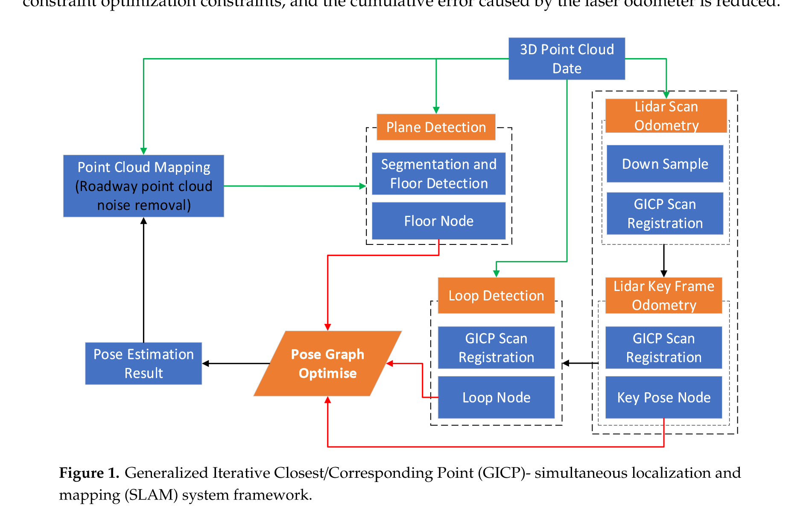

---
aliases:
  [
    "Robust GICP-based 3D LiDAR SLAM for underground mining environment",
    "Zhuli Ren, Liguan Wang, Lin Bi (2019) Robust GICP-based 3D LiDAR SLAM for underground mining environment",
  ]
title: "Robust GICP-based 3D LiDAR SLAM for underground mining environment"
authors: [Zhuli Ren, Liguan Wang, Lin Bi]
first-entry: 2024-05-19#15:00:07
last-entry: 2024-05-19#15:01:38
online-uri: http://zotero.org/users/14320876/items/AQHRST3R
year: 2019
date: 2019-01-01
citekey: renRobustGICPbased3D2019
class: journalArticle
cover: https://covers.openlibrary.org/b/isbn/undefined-M.jpg
---

> [!info]- Metadata
> pdf:: [Ren et al. - 2019 - Robust GICP-based 3D LiDAR SLAM for underground mi.pdf](zotero://select/library/items/GJ8YQL2F)
> extra:: "Publisher: MDPI"
> bibliography:: "[1]

Z. Ren, L. Wang, and L. Bi, ‘Robust GICP-based 3D LiDAR SLAM for underground mining environment’, _Sensors_, vol. 19, no. 13, p. 2915, 2019."

🔥🔥🔥everything above this line might change during an update 🔥🔥🔥
%% begin notes %%
%% end notes %%
%% begin annotations %%

⬇️*Imported (Annotations) on 2024-05-20#09:51:14*⬇️

> [!annotation-red] Highlight
> There are four contributions in this paper: Firstly, Generalized Iterative Closest Point (GICP)-based 3D point cloud registration between consecutive frames and consecutive key frames is first combined to optimize laser odometer constraints, which plays a major role in the unstructured environment. Secondly, a fast point cloud segmentation based on RANdom Sample Consensus (RANSAC) is used to extracts the roadway plane, which serves as a landmark to construct the observation constraint in the graph SLAM optimization. Thirdly, a lightweight and efficient loop detection and optimization based on rules and GICP is designed, which is applied to co(p. [2](zotero://open-pdf/library/items/GJ8YQL2F?page=2&annotation=S28ZYXEL))>
> **comment:**
> test comment
> [2024-05-19#15:00](2024-05-19#15:00)
> #zotero/test_tag

> [!annotation-yellow] Image
> >
> **comment:**
> slam framework
> [2024-05-19#15:01](2024-05-19#15:01)
> #zotero/system_structure

> [!annotation-yellow] Highlight
> T ∝ arg max T ∏ i p(dT i ) ∝arg max T ∑ i log(p(dT i )) ∝ arg max T ∑ i (dT i )T(CM i + T ∗ CB i T∗T)−1(dT i )(p. [5](zotero://open-pdf/library/items/GJ8YQL2F?page=5&annotation=UK9WFR3V))>
> **comment:**
> formula test
> [2024-05-19#15:01](2024-05-19#15:01)
> %% end annotations %%

%% Import Date: 2024-05-20T09:51:21.403+08:00 %%
